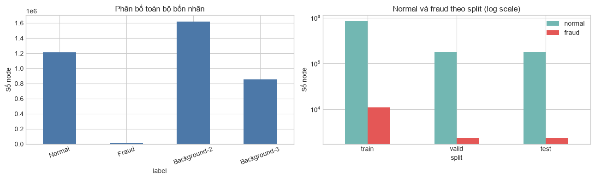
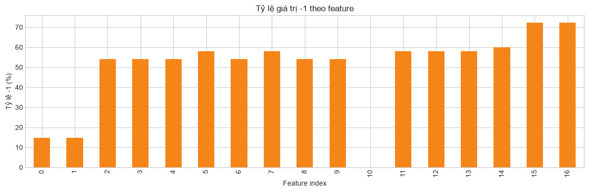
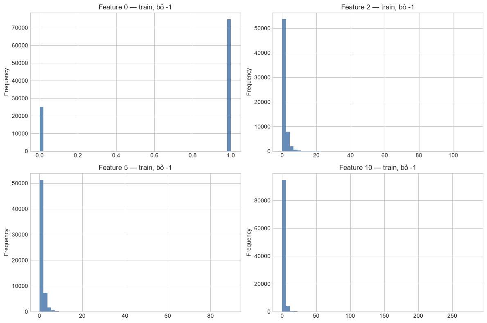
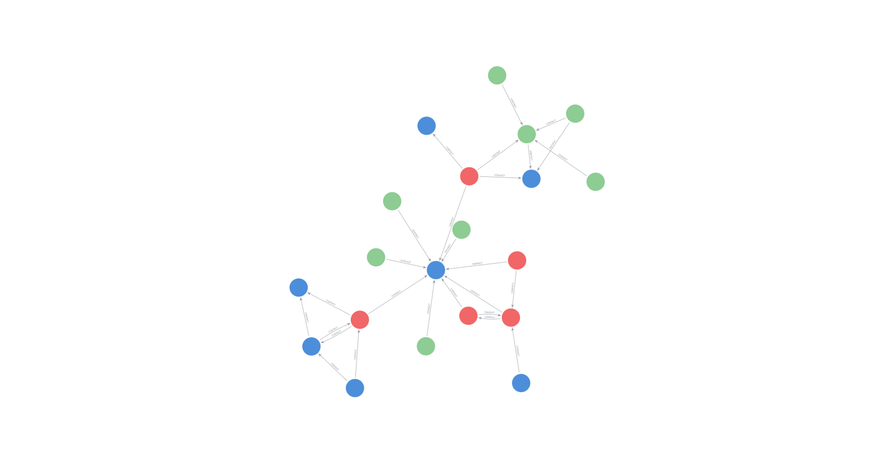
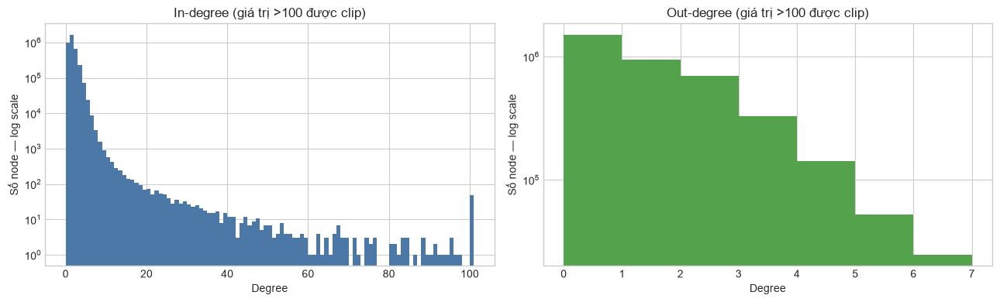
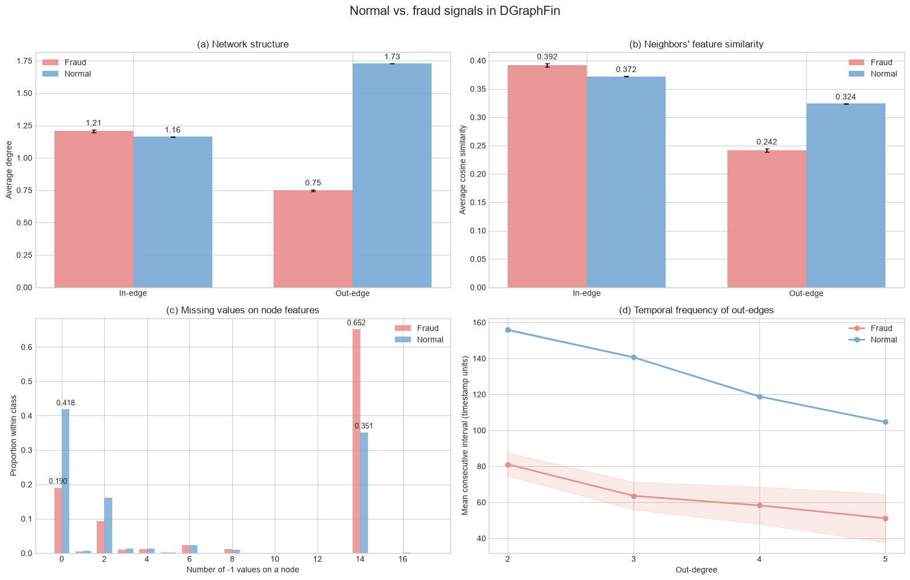

# Báo cáo Sprint 1 — Khám phá dữ liệu và đồ thị DGraphFin

## Tóm tắt điều hành

Sprint 1 tập trung kiểm định chất lượng dữ liệu, mô tả đặc điểm của đồ thị và xác định các tín hiệu có thể hỗ trợ phát hiện gian lận. Kết quả phân tích cho thấy:

- Dataset hợp lệ, gồm **3.700.550 node**, **4.300.999 cạnh có hướng** và **17 feature** trên mỗi node.
- Trong 1.225.601 node mục tiêu, chỉ có **15.509 node fraud**; tỷ lệ fraud ở cả ba tập train, validation và test đều xấp xỉ **1,27%**.
- Giá trị `-1` xuất hiện có hệ thống và với tần suất rất khác nhau giữa các feature. Mẫu thiếu dữ liệu cũng khác biệt rõ giữa hai nhóm normal và fraud.
- Cấu trúc liên kết, mức tương đồng với hàng xóm và nhịp thời gian của các cạnh đều cho thấy tín hiệu phân biệt giữa normal và fraud.
- Neighbor sampling hai lớp với fan-out `[15, 10]` và batch 1.024 có chi phí bộ nhớ và thời gian phù hợp để làm cấu hình khởi đầu trên CPU.

Sprint 1 chưa đánh giá hiệu quả của mô hình. Các kết quả dưới đây là phân tích mô tả, được dùng để chốt cách chuẩn bị dữ liệu và thiết kế thí nghiệm cho Sprint 2.

## 1. Phạm vi phân tích

Báo cáo trả lời năm câu hỏi chính:

1. Dataset có đúng cấu trúc, đầy đủ và nhất quán hay không?
2. Bài toán mất cân bằng đến mức nào và metric nào phù hợp?
3. Giá trị thiếu `-1` xuất hiện ra sao trong 17 feature ẩn danh?
4. Đồ thị có đặc điểm gì về hướng cạnh, degree, loại cạnh và timestamp?
5. Neighbor sampling hai lớp có khả thi trên tài nguyên CPU hay không?

Nguồn số liệu là kết quả thực thi trong [`01_dgraphfin_eda.ipynb`](../notebooks/01_dgraphfin_eda.ipynb). File dữ liệu được đối chiếu bằng SHA-256:
`95470dab2c48523f7118a92204c090de37a957bb053bd5841c7bdba09558ba85`.

## 2. Tổng quan dataset

| Hạng mục | Kết quả |
|---|---:|
| Tổng số node | 3.700.550 |
| Tổng số cạnh có hướng | 4.300.999 |
| Số feature trên mỗi node | 17 |
| Normal (nhãn 0) | 1.210.092 |
| Fraud (nhãn 1) | 15.509 |
| Background (nhãn 2) | 1.620.851 |
| Background (nhãn 3) | 854.098 |
| Số loại cạnh | 11 |
| Miền timestamp | 1–821, đủ 821 giá trị |
| Self-loop | 0 |
| Node cô lập | 0 |

Hai lớp background chiếm **66,88%** tổng số node. Chúng không tham gia loss hoặc metric phân loại, nhưng vẫn cần được giữ trong đồ thị vì tạo ngữ cảnh liên kết cho các node mục tiêu.

### Phân bố train, validation và test

| Split | Tổng node | Normal | Fraud | Tỷ lệ fraud |
|---|---:|---:|---:|---:|
| Train | 857.899 | 847.042 | 10.857 | 1,2655% |
| Validation | 183.862 | 181.536 | 2.326 | 1,2651% |
| Test | 183.840 | 181.514 | 2.326 | 1,2652% |

Ba split có tỷ lệ fraud gần như giống nhau, không chồng lấn và chỉ chứa hai nhãn mục tiêu `0/1`. Phân bố này phù hợp để so sánh kết quả giữa các split, nhưng mức mất cân bằng khoảng **1 fraud trên 78 normal** khiến accuracy không phản ánh tốt chất lượng phát hiện gian lận.

Vì vậy, **Average Precision (AP)** được chọn làm metric chính; ROC-AUC được báo cáo bổ sung. Validation AP được dùng để lựa chọn mô hình, còn test chỉ dùng cho đánh giá cuối cùng.

## 3. Kết quả kiểm định tính toàn vẹn

Dataset vượt qua toàn bộ kiểm tra về cấu trúc và tính nhất quán:

- Các trường dữ liệu có kích thước tương thích với số node và số cạnh.
- Node ID của mọi cạnh đều nằm trong miền hợp lệ.
- Feature không chứa `NaN` hoặc giá trị vô hạn.
- Các tập train, validation và test không có phần tử trùng lặp hoặc giao nhau.
- Các split bao phủ toàn bộ node thuộc hai lớp mục tiêu normal và fraud.
- Nhãn, loại cạnh và timestamp đều nằm trong miền kỳ vọng.
- Không phát hiện lỗi hoặc cảnh báo sau khi kiểm tra toàn bộ dataset.

Kết quả này xác nhận dữ liệu đủ tin cậy để chuyển sang giai đoạn xây dựng baseline.

## 4. Giá trị thiếu và phân phối feature

Trong DGraphFin, `-1` là ký hiệu cho giá trị thiếu. Tỷ lệ `-1` không đồng đều giữa 17 feature:

- Feature 10 không có giá trị `-1`.
- Feature 0 và 1 có tỷ lệ `-1` thấp nhất, lần lượt **14,72%** và **14,77%**.
- Phần lớn feature từ 2 đến 14 có tỷ lệ `-1` khoảng **54–60%**.
- Feature 15 và 16 có tỷ lệ cao nhất, cùng ở mức **72,26%**.

Phân phối trên train split cũng cho thấy các feature có bản chất rất khác nhau: feature 0 gần như nhị phân, trong khi feature 2, 5 và 10 lệch phải mạnh và có đuôi dài.

Do ý nghĩa của các feature đã được ẩn danh và `-1` mang thông tin về trạng thái thiếu, không nên coi `-1` như một giá trị số thông thường hoặc chuẩn hóa dữ liệu một cách mặc định. Sprint 2 cần so sánh trực tiếp hai phương án: giữ nguyên 17 feature và bổ sung 17 biến chỉ báo thiếu dữ liệu.

## 5. Đặc điểm của đồ thị có hướng

### 5.1. Minh họa sample nhỏ bằng Neo4j Bloom

Để minh họa trực quan cấu trúc node và cạnh, một sample liên thông nhỏ được trích từ ba Fraud seed có vị trí gần nhau trên đồ thị. Sample giữ toàn bộ hàng xóm 1-hop của các seed và được mở rộng bằng các Normal node lân cận có liên kết thật trong dữ liệu. Tất cả cạnh vẫn giữ nguyên hướng, `edge_type` và `timestamp`.

Sample gồm **20 node** và **27 cạnh có hướng**, với thành phần:

| Nhóm node | Số lượng | Màu hiển thị |
|---|---:|---|
| Fraud | 5 | Đỏ |
| Normal | 8 | Xanh lá |
| Background (nhãn 2 và 3) | 7 | Xanh dương |

Hình trên chỉ minh họa cách một sample nhỏ được biểu diễn trong Neo4j Bloom. Do sample có kích thước nhỏ và được chọn có chủ đích để bảo đảm tính liên thông, hình không được sử dụng để suy luận hoặc kết luận về cấu trúc của toàn bộ DGraphFin hay sự khác biệt giữa các nhóm node.

### 5.2. Thống kê cấu trúc toàn đồ thị

| Thống kê | In-degree | Out-degree |
|---|---:|---:|
| Trung bình | 1,162 | 1,162 |
| Trung vị | 1 | 1 |
| Phân vị 90% | 2 | 3 |
| Phân vị 99% | 5 | 5 |
| Phân vị 99,9% | 9 | 6 |
| Lớn nhất | 882 | 6 |

Đồ thị thưa nhưng bất đối xứng rõ rệt: out-degree bị chặn ở 6, trong khi một số node nhận tới 882 cạnh. Vì vậy, hướng `source → target` là một phần quan trọng của dữ liệu và cần được bảo toàn trong cấu hình chuẩn; đồ thị hai chiều chỉ nên được đánh giá như một biến thể thí nghiệm.

Phân bố theo nhóm node cho thấy background đóng vai trò đáng kể trong cấu trúc đồ thị:

| Quan hệ cạnh | Số cạnh | Tỷ trọng |
|---|---:|---:|
| Target → Target | 746.271 | 17,35% |
| Target → Background | 1.356.540 | 31,54% |
| Background → Target | 679.410 | 15,80% |
| Background → Background | 1.518.778 | 35,31% |

Chỉ **17,35%** số cạnh nối trực tiếp hai node mục tiêu. Việc loại các node background sẽ làm mất phần lớn ngữ cảnh của đồ thị. Bên cạnh đó, 11 loại cạnh và toàn bộ timestamp cần được bảo toàn để phục vụ các mô hình quan hệ và thời gian ở những sprint sau.

## 6. Tín hiệu phân biệt normal và fraud

Phân tích so sánh hai nhóm tập trung vào bốn khía cạnh: cấu trúc mạng, mức tương đồng với hàng xóm, mẫu thiếu dữ liệu và khoảng thời gian giữa các out-edge.

### 6.1. Cấu trúc mạng

In-degree trung bình của fraud và normal khá gần nhau, lần lượt là **1,21** và **1,16**. Ngược lại, out-degree trung bình của normal đạt **1,73**, cao hơn nhiều so với **0,75** của fraud. Chênh lệch này cho thấy cấu trúc liên kết mang thông tin mà feature riêng lẻ của từng node không thể hiện đầy đủ.

### 6.2. Mức tương đồng với hàng xóm

Ở phía out-edge, cosine similarity trung bình của fraud là **0,242**, thấp hơn mức **0,324** của normal. Với in-edge, hai nhóm gần nhau hơn và fraud cao nhẹ (**0,392** so với **0,372**).

Các giá trị trung bình này tính cả node không có hàng xóm theo hướng tương ứng với similarity bằng 0, nên đồng thời phản ánh tỷ lệ node có kết nối và mức giống nhau về feature. Vì thế, kết quả chỉ nên được xem là tín hiệu mô tả, không phải bằng chứng rằng similarity tự nó quyết định nhãn fraud.

### 6.3. Mẫu thiếu dữ liệu

Trong nhóm normal, **41,8%** node không có feature nào nhận giá trị `-1`; tỷ lệ tương ứng ở fraud chỉ là **19,0%**. Ngược lại, **65,2%** node fraud có đúng 14 giá trị thiếu, so với **35,1%** ở normal. Đây là khác biệt mạnh nhất quan sát được trong EDA và là cơ sở trực tiếp cho thí nghiệm bổ sung biến chỉ báo thiếu dữ liệu.

### 6.4. Tần suất giao dịch theo thời gian

Với cùng out-degree từ 2 đến 5, khoảng thời gian trung bình giữa các out-edge của fraud luôn thấp hơn normal:

| Out-degree | Fraud | Normal |
|---:|---:|---:|
| 2 | 81,15 | 155,87 |
| 3 | 63,62 | 140,62 |
| 4 | 58,31 | 118,86 |
| 5 | 51,11 | 104,67 |

Fraud có xu hướng tạo các cạnh ra dồn dập hơn. Đây là tín hiệu đáng để khai thác trong temporal modeling, nhưng chưa phải kết quả đánh giá của một mô hình thời gian.

## 7. Khả năng xử lý trên CPU

Benchmark được thực hiện trên dữ liệu đầy đủ với 1.024 node train, hai lớp hàng xóm có fan-out `[15, 10]` và seed 42.

| Hạng mục | Kết quả |
|---|---:|
| Tải dataset | 0,574 giây |
| Dựng chỉ mục lấy mẫu | 0,572 giây |
| Lấy một batch | 0,003 giây |
| Bộ nhớ dữ liệu chính | 408,8 MiB |
| Bộ nhớ chỉ mục lấy mẫu | 61,0 MiB |
| Seed node trong batch | 1.024 |
| Tổng node sau sampling | 3.207 |
| Tổng cạnh sau sampling | 2.341 |
| Cạnh theo hop | 1.282 / 1.059 |

Kết quả cho thấy cấu hình này là điểm khởi đầu khả thi trên CPU. Số liệu bộ nhớ mới phản ánh dữ liệu và chỉ mục lấy mẫu, chưa bao gồm tham số mô hình, trạng thái optimizer và activation trong quá trình huấn luyện; do đó vẫn cần dành thêm RAM cho Sprint 2.

## 8. Kết luận và định hướng cho Sprint 2

Sprint 1 đã hoàn thành mục tiêu chuẩn bị một nền dữ liệu đáng tin cậy và xác định được các quyết định chính cho giai đoạn modeling:

- Sử dụng **AP** làm metric chính do tỷ lệ fraud chỉ khoảng 1,27%; ROC-AUC là metric bổ sung.
- Chọn mô hình bằng validation, không dùng test để điều chỉnh hoặc lựa chọn cấu hình.
- So sánh feature gốc 17 chiều với phương án bổ sung chỉ báo thiếu dữ liệu; không mặc định xem `-1` là giá trị số thông thường.
- Giữ nguyên hướng cạnh, các node background, 11 loại cạnh và timestamp trong dữ liệu chuẩn.
- Dùng neighbor sampling `[15, 10]`, batch 1.024 làm cấu hình khởi đầu cho baseline trên CPU.
- Xem xét cấu trúc mạng, ngữ cảnh hàng xóm, missing pattern và nhịp thời gian như bốn nhóm tín hiệu tiềm năng; hiệu quả thực tế phải được xác nhận bằng các thí nghiệm có kiểm soát ở Sprint 2.
