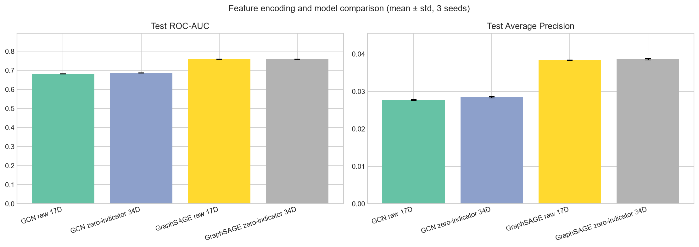
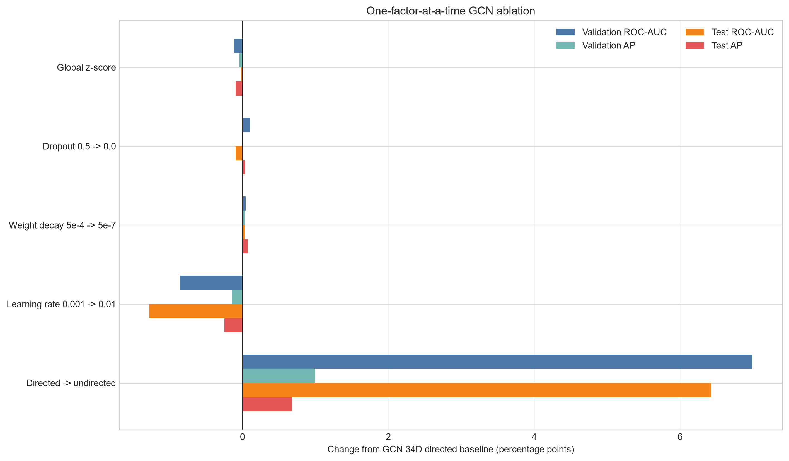
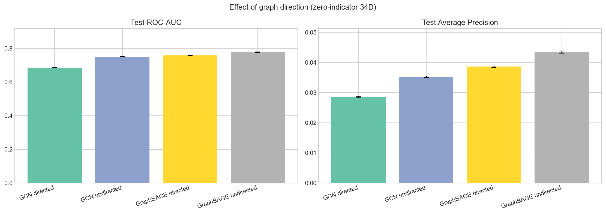
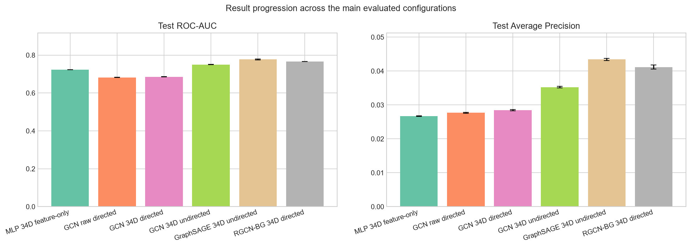

# Báo cáo triển khai Sprint 2: MLP, GCN, GraphSAGE và RGCN

## 1. Phạm vi đã thực hiện

Sprint 2 đã xây dựng pipeline dùng chung cho bốn mô hình node classification:

- MLP hai lớp chỉ dùng feature node, không nhận `edge_index` hoặc neighbor.
- GCN hai lớp dùng `GCNConv`, self-loop và chuẩn hóa của PyG.
- GraphSAGE hai lớp dùng `SAGEConv` với mean aggregation.
- RGCN hai lớp dùng `RGCNConv` và bốn relation theo loại node ở hai đầu cạnh: `T→T`, `T→B`, `B→T`, `B→B`.
- Mini-batch bằng `NeighborLoader`/`pyg-lib`, không dùng full-batch.
- Binary classification với fraud là lớp dương `1`; node lớp `2/3` chỉ tham gia cấu trúc đồ thị.
- `BCEWithLogitsLoss` và `pos_weight` chỉ tính từ train.
- Chọn checkpoint bằng validation Average Precision; test không tham gia lựa chọn.
- Metric bắt buộc: ROC-AUC và Average Precision (AP).
- Lưu config, seed, phiên bản thư viện, SHA-256 dữ liệu, log từng epoch, checkpoint và bảng tổng hợp JSON.

Thiết lập hiện tại là **static, transductive**. Timestamp và 11 edge type gốc chưa tham gia message passing. Riêng RGCN dùng bốn relation suy ra từ target/background; vì vậy kết quả vẫn chưa phải đánh giá fraud-ring động hoặc ý nghĩa của 11 loại quan hệ khẩn cấp.

## 2. Data pipeline

1. Đọc `data/dgraphfin.npz` qua loader của Sprint 1.
2. Giữ nguyên split train/valid/test do DGraph cung cấp.
3. Chuyển feature sang `float32` theo một trong hai chế độ:
   - `raw`: giữ nguyên 17 chiều, bao gồm giá trị `-1`.
   - `zero_indicator`: thay `-1` bằng 0 và nối 17 cờ missing, tổng cộng 34 chiều.
4. Tạo PyG `Data`, giữ đồ thị có hướng canonical.
5. Với RGCN, chuyển loại node ở source/destination thành relation: `0=T→T`, `1=T→B`, `2=B→T`, `3=B→B`; normal và fraud đều thuộc T nên relation không tiết lộ fraud label.
6. Tạo mini-batch: MLP lấy trực tiếp seed node và graph rỗng; GNN dùng neighbor sampling với số hop bằng số lớp message passing.
7. Chỉ tính loss và metric trên các seed node của batch.
8. Đánh giá validation sau mỗi epoch, giữ state có AP tốt nhất, rồi mới đánh giá test.

## 3. Kết quả `baseline_full` 17 chiều

Run chính thức: `artifacts/runs/baseline_full_20260804_135543`. Cấu hình dùng feature `raw` 17 chiều, hidden size 64, hai lớp, dropout 0,5, fan-out `[15, 10]`, batch size 1.024, tối đa 50 epoch, patience 8 và ba seed 42/43/44. Mỗi epoch train đi qua toàn bộ 857.899 seed node; validation và test lần lượt đánh giá đủ 183.862 và 183.840 node. Valid/test đều có 2.326 fraud node. Test không tham gia chọn checkpoint.

| Model | Seed | Best epoch | Epoch đã chạy | Valid ROC-AUC | Valid AP | Test ROC-AUC | Test AP |
|---|---:|---:|---:|---:|---:|---:|---:|
| GCN | 42 | 16 | 24 | 0,670574 | 0,024943 | 0,680981 | 0,027527 |
| GCN | 43 | 46 | 50 | 0,671529 | 0,025073 | 0,683098 | 0,027752 |
| GCN | 44 | 26 | 34 | 0,671151 | 0,024956 | 0,681793 | 0,027793 |
| GraphSAGE | 42 | 14 | 22 | 0,750229 | 0,034916 | 0,757671 | 0,038210 |
| GraphSAGE | 43 | 20 | 28 | 0,750309 | 0,034828 | 0,758297 | 0,038387 |
| GraphSAGE | 44 | 23 | 31 | 0,751207 | 0,034860 | 0,759719 | 0,038330 |

Seed 43 của GCN chạy đủ 50 epoch; năm lượt còn lại dừng sớm theo patience 8. Kết quả tổng hợp dưới đây dùng population standard deviation (`statistics.pstdev`), đúng với `comparison.json`.

| Model | Valid ROC-AUC | Valid AP | Test ROC-AUC | Test AP | Tham số |
|---|---:|---:|---:|---:|---:|
| GCN | 0,671084 ± 0,000393 | 0,024991 ± 0,000059 | 0,681957 ± 0,000872 | 0,027691 ± 0,000117 | 1.217 |
| GraphSAGE | **0,750582 ± 0,000443** | **0,034868 ± 0,000036** | **0,758562 ± 0,000857** | **0,038309 ± 0,000074** | 2.369 |

GraphSAGE cao hơn GCN trên cả ROC-AUC và AP ở validation lẫn test cho cả ba seed. So theo trung bình, GraphSAGE tăng 0,079497 valid ROC-AUC, 0,009877 valid AP, 0,076605 test ROC-AUC và 0,010618 test AP. Độ lệch chuẩn giữa ba seed nhỏ ở cả hai mô hình, cho thấy kết quả ổn định trong phạm vi các seed đã chạy. Đây vẫn là baseline node-level static/transductive; kết quả không chứng minh mô hình đã phát hiện fraud ring hoặc khai thác thời gian.

Tổng thời gian toàn run là 2.302,53 giây (khoảng 38 phút 23 giây). Thời gian từng lượt gồm GCN 275,72/604,06/412,42 giây và GraphSAGE 267,08/350,56/390,65 giây cho seed 42/43/44. Không so sánh trực tiếp tốc độ kiến trúc từ các số này vì số epoch khác nhau do early stopping. RSS cuối lượt tăng từ 1.129,6 lên 2.264,4 MiB khi các lượt chạy tuần tự trong cùng tiến trình, nên không phải peak RAM độc lập của từng mô hình.

## 4. Kết quả zero-indicator 34 chiều và so sánh

Run 34 chiều: `artifacts/runs/baseline_full_zero_indicator_20260804_144710`. So sánh này giữ nguyên dataset SHA-256, split, ba seed 42/43/44, thứ tự model, hidden size 64, hai lớp, dropout 0,5, fan-out `[15, 10]`, batch size 1.024, optimizer, tối đa 50 epoch và patience 8. Cả hai run đều dùng `NeighborLoader`, đi qua đủ 857.899 train seed node mỗi epoch và đánh giá toàn bộ valid/test bằng sampled mini-batch. Khác biệt chủ đích duy nhất là biểu diễn feature: raw 17 chiều so với thay `-1` bằng 0 rồi nối 17 cờ missing thành 34 chiều.

| Model | Seed | Best epoch | Epoch đã chạy | Valid ROC-AUC | Valid AP | Test ROC-AUC | Test AP |
|---|---:|---:|---:|---:|---:|---:|---:|
| GCN | 42 | 16 | 24 | 0,672876 | 0,025488 | 0,684317 | 0,028356 |
| GCN | 43 | 40 | 48 | 0,672686 | 0,025696 | 0,686276 | 0,028732 |
| GCN | 44 | 49 | 50 | 0,674420 | 0,025731 | 0,686299 | 0,028234 |
| GraphSAGE | 42 | 19 | 27 | 0,752051 | 0,035488 | 0,759180 | 0,038729 |
| GraphSAGE | 43 | 8 | 16 | 0,750733 | 0,035331 | 0,757400 | 0,038262 |
| GraphSAGE | 44 | 19 | 27 | 0,751379 | 0,035369 | 0,759079 | 0,038812 |

| Model / feature | Valid ROC-AUC | Valid AP | Test ROC-AUC | Test AP | Tham số |
|---|---:|---:|---:|---:|---:|
| GCN, raw 17D | 0,671084 ± 0,000393 | 0,024991 ± 0,000059 | 0,681957 ± 0,000872 | 0,027691 ± 0,000117 | 1.217 |
| GCN, zero-indicator 34D | **0,673327 ± 0,000777** | **0,025638 ± 0,000107** | **0,685631 ± 0,000929** | **0,028441 ± 0,000212** | 2.305 |
| GraphSAGE, raw 17D | 0,750582 ± 0,000443 | 0,034868 ± 0,000036 | **0,758562 ± 0,000857** | 0,038309 ± 0,000074 | 2.369 |
| GraphSAGE, zero-indicator 34D | **0,751388 ± 0,000539** | **0,035396 ± 0,000067** | 0,758553 ± 0,000816 | **0,038601 ± 0,000242** | 4.545 |

Chênh lệch trung bình `34D - 17D`:

| Model | Δ Valid ROC-AUC | Δ Valid AP | Δ Test ROC-AUC | Δ Test AP |
|---|---:|---:|---:|---:|
| GCN | +0,002243 | +0,000648 | +0,003673 | +0,000750 |
| GraphSAGE | +0,000806 | +0,000528 | -0,000010 | +0,000292 |

*Hình 1. Test ROC-AUC và AP trung bình (± độ lệch chuẩn, 3 seed) theo cách mã hóa feature và kiến trúc mô hình.*

Zero-indicator cải thiện cả bốn metric trung bình của GCN. Với GraphSAGE, 34D cải thiện validation ROC-AUC/AP và test AP; test ROC-AUC giảm 0,000010, về thực tế là gần như hòa. Vì checkpoint được chọn bằng validation AP, kết quả 34D tốt hơn về tiêu chí lựa chọn cho cả hai kiến trúc. Tuy nhiên mức cải thiện nhỏ so với việc số tham số lớp đầu gần gấp đôi, và mới có ba seed; do đó nên diễn giải đây là bằng chứng thực nghiệm có lợi cho việc biểu diễn missing value, không phải kết luận thống kê tuyệt đối.

Run 34D mất 1.922,17 giây (khoảng 32 phút 2 giây), so với 2.302,53 giây của run 17D. Không kết luận 34D nhanh hơn vì số epoch do early stopping khác nhau: tổng cộng 192 epoch ở 34D so với 189 epoch ở 17D, đồng thời thời gian hệ thống có thể dao động giữa hai lần chạy.

### 4.1. MLP 34D feature-only: đối chứng không dùng cấu trúc graph

Run chính thức: `artifacts/runs/mlp_zero_indicator_20260813_144227`. MLP gồm hai
linear layer `34 → 64 → 1`, ReLU và dropout 0,5. Thiết kế này có đúng 2.305 tham số,
bằng GCN 34D, nhưng không nhận cạnh và không thực hiện message passing. Mỗi mini-batch
chứa 1.024 node đích cùng feature của chính chúng; artifact ghi
`sampling_protocol=node_minibatch_no_edges`, `uses_graph_structure=false` và
`graph_edge_count=0`.

Để so sánh công bằng, MLP giữ nguyên feature zero-indicator 34D, train/validation/test
split, seed 42/43/44, batch size, Adam, learning rate `0,001`, weight decay `5e-4`,
dropout `0,5`, `pos_weight`, gradient clipping, tối đa 50 epoch, patience 8 và chọn
checkpoint bằng validation AP. Fan-out và hướng graph không áp dụng cho MLP vì model
không sử dụng cấu trúc cạnh.

| Seed | Best epoch | Epoch đã chạy | Valid ROC-AUC | Valid AP | Test ROC-AUC | Test AP | Thời gian (giây) |
|---:|---:|---:|---:|---:|---:|---:|---:|
| 42 | 5 | 13 | 0,717907 | 0,025978 | 0,722330 | 0,026540 | 43,6 |
| 43 | 16 | 24 | 0,719217 | 0,026130 | 0,723412 | 0,026739 | 82,3 |
| 44 | 8 | 16 | 0,718457 | 0,026225 | 0,722749 | 0,026749 | 56,6 |
| **Mean ± std** | — | — | **0,718527 ± 0,000537** | **0,026111 ± 0,000102** | **0,722830 ± 0,000446** | **0,026676 ± 0,000096** | **182,5 tổng seed** |

| Model 34D | Dùng graph | Valid ROC-AUC | Valid AP | Test ROC-AUC | Test AP | Tham số |
|---|---|---:|---:|---:|---:|---:|
| MLP | Không | 0,718527 ± 0,000537 | 0,026111 ± 0,000102 | 0,722830 ± 0,000446 | 0,026676 ± 0,000096 | 2.305 |
| GCN directed | Có | 0,673327 ± 0,000777 | 0,025638 ± 0,000107 | 0,685631 ± 0,000929 | 0,028441 ± 0,000212 | 2.305 |
| GraphSAGE directed | Có | **0,751388 ± 0,000539** | **0,035396 ± 0,000067** | **0,758553 ± 0,000816** | **0,038601 ± 0,000242** | 4.545 |

MLP cao hơn GCN directed `0,037200` test ROC-AUC nhưng thấp hơn `0,001765` test AP.
Vì AP quan trọng hơn trong dữ liệu fraud mất cân bằng và là tiêu chí chọn model, không
thể kết luận GCN directed tốt hơn baseline feature-only. Ngược lại, GraphSAGE directed
cao hơn MLP `0,035722` test ROC-AUC và `0,011925` test AP, đồng thời có validation AP
cao hơn rõ rệt. Kết quả cho thấy cấu trúc graph có thể cung cấp tín hiệu bổ sung, nhưng
lợi ích phụ thuộc cách kiến trúc tổng hợp neighbor; chỉ “dùng graph” không tự động bảo
đảm metric tốt hơn.

## 5. RGCN 34 chiều và vai trò của background node

Run: `artifacts/runs/rgcn_background_full_20260804_164346`. Thí nghiệm dùng zero-indicator 34D và giữ nguyên dataset SHA-256, split, seed 42/43/44, hai lớp message passing, dropout 0,5, fan-out `[15, 10]`, batch 1.024, optimizer, tối đa 50 epoch, patience 8 và quy tắc chọn checkpoint bằng validation AP như GCN 34D.

GCN không nhận biết rõ target/background; hai loại node đi qua cùng một phép biến đổi. RGCN dùng bốn phép biến đổi theo loại endpoint. Để hạn chế lợi thế chỉ do model lớn hơn, hidden size của RGCN được đặt là 13, tạo 2.289 tham số, gần khớp GCN hidden 64 có 2.305 tham số (chênh 16 tham số, khoảng 0,7%). Cả hai vẫn giữ background node trong sampled graph và không tính supervised loss trên background node.

| Relation | Ý nghĩa | Số cạnh | Tỷ lệ |
|---:|---|---:|---:|
| 0 | T→T | 746.271 | 17,351% |
| 1 | T→B | 1.356.540 | 31,540% |
| 2 | B→T | 679.410 | 15,797% |
| 3 | B→B | 1.518.778 | 35,312% |

Như vậy 82,649% cạnh có ít nhất một background endpoint, cho thấy background node chiếm phần lớn cấu trúc kết nối của graph.

| Model | Seed | Best epoch | Epoch đã chạy | Valid ROC-AUC | Valid AP | Test ROC-AUC | Test AP |
|---|---:|---:|---:|---:|---:|---:|---:|
| RGCN | 42 | 19 | 27 | 0,754589 | 0,036613 | 0,766519 | 0,041159 |
| RGCN | 43 | 21 | 29 | 0,757217 | 0,036448 | 0,766109 | 0,040447 |
| RGCN | 44 | 15 | 23 | 0,757403 | 0,037265 | 0,766980 | 0,041907 |

| Model 34D | Valid ROC-AUC | Valid AP | Test ROC-AUC | Test AP | Tham số |
|---|---:|---:|---:|---:|---:|
| GCN | 0,673327 ± 0,000777 | 0,025638 ± 0,000107 | 0,685631 ± 0,000929 | 0,028441 ± 0,000212 | 2.305 |
| RGCN-BG | **0,756403 ± 0,001285** | **0,036775 ± 0,000353** | **0,766536 ± 0,000356** | **0,041171 ± 0,000596** | 2.289 |

Chênh lệch trung bình `RGCN-BG - GCN`:

| Valid ROC-AUC | Valid AP | Test ROC-AUC | Test AP |
|---:|---:|---:|---:|
| +0,083076 | +0,011137 | +0,080905 | +0,012730 |

RGCN cao hơn GCN trên cả bốn metric ở cả ba paired seed, trong khi số tham số gần như bằng nhau. Kết quả này là bằng chứng mạnh rằng việc cho model biết message thuộc quan hệ target/background nào giúp khai thác graph DGraph tốt hơn so với coi mọi cạnh đồng nhất. Tuy nhiên cả GCN và RGCN đều giữ background node; do đó thí nghiệm chứng minh lợi ích của **mã hóa rõ vai trò background trong message passing**, chưa trực tiếp đo mức suy giảm khi loại bỏ background node. Muốn kết luận nhân quả về việc giữ/xóa background, cần thêm ablation loại bỏ một phần hoặc toàn bộ background như paper.

Run RGCN mất 874,56 giây (khoảng 14 phút 35 giây). Ba lượt lần lượt mất 324,09/304,53/244,02 giây; không dùng số RSS cuối lượt để so sánh peak RAM độc lập vì các seed chạy tuần tự trong cùng tiến trình.

## 6. Ablation GCN 34D: feature, regularization, learning rate và hướng cạnh

Năm ablation dùng GCN zero-indicator 34D làm đối chứng: `artifacts/runs/baseline_full_zero_indicator_20260804_144710`. Từng run chỉ đổi **một** yếu tố, còn lại giữ nguyên dataset SHA-256, split, ba seed 42/43/44, hidden size 64, hai lớp, fan-out `[15, 10]`, batch 1.024, tối đa 50 epoch, patience 8, `pos_weight`, gradient clipping và chọn checkpoint bằng validation AP. Mỗi epoch vẫn đi qua đủ 857.899 train seed node; valid/test được đánh giá trên toàn bộ 183.862/183.840 node bằng `NeighborLoader`, không giới hạn số batch.

Các run chính thức:

- Z-score: `artifacts/runs/gcn_ablation_standardized_20260805_101917`.
- Dropout 0: `artifacts/runs/gcn_ablation_dropout0_20260805_103903`.
- Weight decay `5e-7`: `artifacts/runs/gcn_ablation_weight_decay_5e7_20260805_105040`.
- Learning rate `0.01`: `artifacts/runs/gcn_ablation_lr001_20260805_111120`.
- Undirected, GCN và GraphSAGE: `artifacts/runs/gcn_graphsage_ablation_undirected_20260805_112806`.

Ở ablation feature, z-score được tính theo từng cột trên toàn bộ feature 34D sau zero-indicator. Đây là thống kê feature không dùng label trong thiết lập transductive. Ở ablation hướng cạnh, mỗi cạnh được thêm chiều ngược rồi coalesce; số cạnh tăng từ 4.300.999 lên 7.994.520. Cấu trúc DGraph gốc vẫn được xem là có hướng; biến thể vô hướng chỉ là protocol message passing/benchmark để đối chiếu với paper.

| Biến thể GCN 34D | Valid ROC-AUC | Valid AP | Test ROC-AUC | Test AP |
|---|---:|---:|---:|---:|
| Baseline: chưa z-score, dropout 0,5, WD `5e-4`, LR `0.001`, directed | 0,673327 ± 0,000777 | 0,025638 ± 0,000107 | 0,685631 ± 0,000929 | 0,028441 ± 0,000212 |
| Global z-score | 0,672151 ± 0,000374 | 0,025239 ± 0,000025 | 0,685454 ± 0,000338 | 0,027482 ± 0,000127 |
| Dropout `0.0` | 0,674312 ± 0,001607 | 0,025595 ± 0,000188 | 0,684688 ± 0,003102 | 0,028833 ± 0,000488 |
| Weight decay `5e-7` | 0,673765 ± 0,001834 | 0,025983 ± 0,000157 | 0,685957 ± 0,002712 | 0,029182 ± 0,000300 |
| Learning rate `0.01` | 0,664749 ± 0,001717 | 0,024187 ± 0,000103 | 0,672862 ± 0,002968 | 0,025956 ± 0,000190 |
| **Undirected** | **0,743221 ± 0,000953** | **0,035593 ± 0,000126** | **0,749892 ± 0,000737** | **0,035248 ± 0,000255** |

Chênh lệch trung bình `ablation - baseline`:

| Thay đổi duy nhất | Δ Valid ROC-AUC | Δ Valid AP | Δ Test ROC-AUC | Δ Test AP | Kết luận |
|---|---:|---:|---:|---:|---|
| Global z-score | -0,001177 | -0,000399 | -0,000177 | -0,000959 | Không cải thiện |
| Dropout `0.5 → 0.0` | +0,000985 | -0,000044 | -0,000943 | +0,000392 | Trade-off nhỏ, độ lệch seed tăng |
| Weight decay `5e-4 → 5e-7` | +0,000437 | +0,000345 | +0,000327 | +0,000742 | Cải thiện mean cả bốn metric; AP có lợi rõ hơn AUC |
| Learning rate `0.001 → 0.01` | -0,008579 | -0,001451 | -0,012768 | -0,002485 | Giảm rõ cả bốn metric |
| Directed → undirected | **+0,069894** | **+0,009955** | **+0,064261** | **+0,006807** | Cải thiện lớn và ổn định nhất |

*Hình 2. Mức thay đổi so với GCN 34D directed baseline khi lần lượt thay đổi từng yếu tố.*

Best epoch của các seed 42/43/44 lần lượt là `25/19/19` (z-score), `3/14/15` (dropout 0), `16/14/49` (weight decay), `6/6/8` (LR 0,01) và `27/31/36` (undirected). Tổng thời gian từng run lần lượt là 1.152,98; 667,64; 1.207,64; 984,91 và 2.441,40 giây. Không dùng thời gian để xếp hạng tốc độ kiến trúc vì số epoch do early stopping khác nhau; riêng undirected còn tăng kích thước graph và RSS cuối lượt tối đa từ khoảng 1.944 MiB lên 2.718 MiB.

Kết luận thực nghiệm: **đối xứng hóa graph là yếu tố duy nhất tạo mức tăng lớn, nhất quán và vượt xa nhiễu giữa seed**, đưa GCN từ test `0,6856/0,0284` lên `0,7499/0,0352` ROC-AUC/AP, gần kết quả GCN `0,751/0,037` trong paper. Điều này cho thấy GCN hưởng lợi mạnh khi message passing được phép truyền theo cả hai chiều trong protocol hiện tại; không chứng minh quan hệ khẩn cấp gốc là vô hướng. Weight decay `5e-7` chỉ cải thiện mean ở mức nhỏ, dropout 0 tạo trade-off, global z-score không có lợi và LR 0,01 làm giảm metric. Vì vậy cấu hình được chọn chỉ áp dụng **undirected**, vẫn giữ weight decay `5e-4` và toàn bộ siêu tham số baseline khác.

### 6.1. GraphSAGE 34D với graph vô hướng

Sau khi chọn undirected, GraphSAGE được train lại với đúng cùng dataset, split, seed 42/43/44, zero-indicator 34D, hidden size 64, hai lớp, dropout 0,5, weight decay `5e-4`, learning rate `0.001`, fan-out `[15,10]`, batch 1.024, tối đa 50 epoch, patience 8 và tiêu chí validation AP như GCN-undirected. GCN không được train lại; ba checkpoint GCN hiện có được giữ nguyên và ghép với ba checkpoint GraphSAGE trong run kết hợp.

| Model | Seed | Best epoch | Epoch đã chạy | Valid ROC-AUC | Valid AP | Test ROC-AUC | Test AP |
|---|---:|---:|---:|---:|---:|---:|---:|
| GraphSAGE-undirected | 42 | 35 | 43 | 0,769785 | 0,039018 | 0,778607 | 0,043887 |
| GraphSAGE-undirected | 43 | 8 | 16 | 0,766678 | 0,038568 | 0,774436 | 0,043081 |
| GraphSAGE-undirected | 44 | 26 | 34 | 0,768949 | 0,038248 | 0,778010 | 0,043257 |

| GraphSAGE 34D | Valid ROC-AUC | Valid AP | Test ROC-AUC | Test AP |
|---|---:|---:|---:|---:|
| Directed | 0,751388 ± 0,000539 | 0,035396 ± 0,000067 | 0,758553 ± 0,000816 | 0,038601 ± 0,000242 |
| **Undirected** | **0,768470 ± 0,001313** | **0,038611 ± 0,000316** | **0,777018 ± 0,001842** | **0,043408 ± 0,000346** |
| Δ Undirected - Directed | **+0,017083** | **+0,003216** | **+0,018465** | **+0,004807** |

*Hình 3. Test ROC-AUC và AP của GCN/GraphSAGE trên graph có hướng và vô hướng (trung bình ± độ lệch chuẩn).*

Undirected cải thiện cả bốn mean metric của GraphSAGE và cả ba paired seed đều tăng test ROC-AUC/AP so với run directed. Test `0,7770/0,0434` cũng gần kết quả GraphSAGE `0,778/0,043` trong paper. Trong cùng thiết lập undirected, GraphSAGE cao hơn GCN `+0,027126` test ROC-AUC và `+0,008161` test AP. Riêng component GraphSAGE mất 2.714,68 giây; tổng hai component GCN và GraphSAGE trong artifact kết hợp là 5.156,08 giây, nhưng chúng được train ở hai tiến trình tuần tự khác nhau nên con số này chỉ dùng để ghi nhận chi phí.

*Hình 4. MLP feature-only và tiến triển Test ROC-AUC/AP qua các cấu hình GNN chính; RGCN-BG là thí nghiệm directed độc lập.*

## 7. Artifact và khả năng tái kiểm tra

Các run full và ablation lưu cùng cấu trúc artifact:

- `config.json`: toàn bộ siêu tham số thực nghiệm.
- `comparison.json`: môi trường, fingerprint dữ liệu, kết quả từng model và aggregate.
- Hai run baseline và run undirected kết hợp có sáu checkpoint GCN/GraphSAGE; run MLP, RGCN và bốn run ablation GCN còn lại có ba checkpoint theo seed 42/43/44, đều chọn theo AP validation.
- Mỗi thư mục model-seed có `metrics.json`: loss, validation metric theo epoch và test metric của checkpoint tốt nhất.
- `artifacts/metrics/sprint2_results.json`: catalog gọn, có version schema, được tổng hợp từ chín experiment để notebook và biểu đồ đọc trực tiếp mà không cần commit checkpoint.

Ba notebook đã được chạy lại đầu-cuối: EDA chạy trên dataset đầy đủ, training chạy quick smoke mode và analysis đọc toàn bộ catalog. Không notebook nào có error output. Checkpoint chính thức vẫn được lưu cùng model config và validation AP để có thể dựng lại model khi chuyển sang giai đoạn đóng gói/deploy.

## 8. Trạng thái cấu hình thực nghiệm

- Registry `EXPERIMENTS` trong `02_gnn_training.ipynb` chứa trực tiếp MLP feature-only, baseline raw 17D, baseline zero-indicator 34D, RGCN-BG và các ablation.
- MLP dùng hidden size 64, hai linear layer và 2.305 tham số như GCN 34D; model nhận node mini-batch nhưng không nhận cạnh.
- Baseline GCN/GraphSAGE dùng hidden size 64, fan-out `[15, 10]`, batch 1.024, tối đa 50 epoch, patience 8 và ba seed 42/43/44.
- RGCN 34D được parameter-match với bốn relation target/background theo paper.
- Các phép thử z-score, dropout, weight decay, learning rate và graph vô hướng tuân theo one-factor-at-a-time.

Chín experiment trong catalog đã được chạy mà không điều chỉnh siêu tham số dựa trên test metric.

## 9. Giới hạn và bước tiếp theo

- Neighbor sampling làm prediction có thể dao động; seed evaluation đã được cố định.
- MLP là đối chứng feature-only; so sánh này đo giá trị end-to-end của từng GNN so với không dùng graph, không cô lập riêng từng cơ chế aggregation.
- Baseline chưa dùng timestamp, 11 edge type gốc hoặc temporal split; RGCN chỉ dùng relation target/background suy ra từ loại node.
- So sánh GCN/RGCN chưa thay thế ablation loại bỏ background node; nó đo lợi ích của relation-aware message passing.
- Node-level fraud classification chưa trực tiếp xuất ra fraud ring.
- So sánh raw và `zero_indicator` phải dựa trên validation; test chỉ báo cáo sau khi khóa lựa chọn.
- Cần bổ sung đo peak RAM/CPU độc lập nếu muốn so sánh hiệu năng hệ thống giữa hai kiến trúc.
- Năm ablation GCN đo riêng từng yếu tố; quyết định hiện tại chỉ chọn undirected vì mức tăng lớn và nhất quán. Không cộng thêm weight decay `5e-7`, do cải thiện của nó nhỏ và biến thiên AUC giữa seed lớn hơn baseline.
