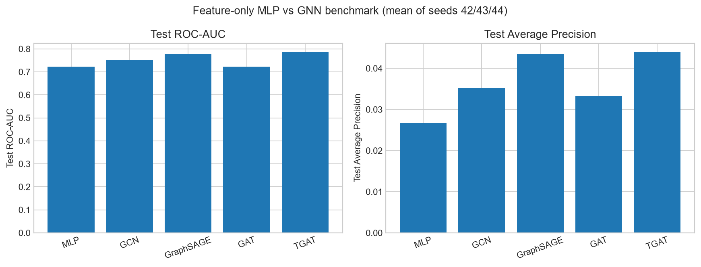

# Báo cáo Sprint 3 — GAT và TGAT trên graph undirected

## 1. Phạm vi

Sprint 3 đánh giá **GAT** và **TGAT** cho node-level fraud classification trên
DGraphFin. Benchmark cuối cùng đặt MLP feature-only cạnh GCN, GraphSAGE, GAT và TGAT;
các GNN dùng graph undirected, còn MLP hoàn toàn không nhận cấu trúc cạnh.

## 2. Protocol thực nghiệm

| Thành phần | Giá trị |
|---|---|
| Dataset SHA-256 | `95470dab2c48523f7118a92204c090de37a957bb053bd5841c7bdba09558ba85` |
| Task/split | Node classification; giữ nguyên train/validation/test index nguồn |
| Feature | `zero_indicator`, 34 chiều, không standardize |
| Graph | MLP không dùng cạnh; các GNN dùng undirected message passing |
| Seed | 42, 43, 44 |
| Batch | 1.024 seed node |
| Training | Adam; LR 0,001; weight decay 5e-4; dropout 0,5; tối đa 50 epoch; patience 8 |
| Loss | `BCEWithLogitsLoss`; `pos_weight=78,0181` chỉ tính từ train |
| Model selection | Validation AP |
| Test isolation | Test không dùng chọn cấu hình hoặc checkpoint |
| Evaluation | Đủ 183.862 validation node và 183.840 test node; mỗi split có 2.326 fraud node |

Các điều kiện chung gồm dataset, split, feature, seed, batch, optimizer, ngân sách
epoch, early stopping, loss và tiêu chí chọn checkpoint. Cách lấy context phụ thuộc
loại pipeline:

- MLP có hai linear layer `34 → 64 → 1`, dùng node mini-batch 1.024 nhưng không nhận
  `edge_index`, fan-out hoặc neighbor; model có 2.305 tham số, bằng GCN 34D.
- GCN, GraphSAGE và GAT dùng `structural_coalesced`: thêm cạnh đảo rồi coalesce theo
  cặp node, tạo 7.994.520 structural edge. Các model static dùng hai layer và fan-out
  `[15,10]`.
- TGAT dùng `temporal_event_mirror`: mỗi event `u→v` tại thời điểm `t` tạo thêm event
  truyền message `v→u` với cùng timestamp và edge type, tạo 8.601.998 event edge.
  TGAT có một `TransformerConv`, vì vậy dùng đúng một sampling hop `[15]`.

Do MLP không dùng graph và các GNN khác depth, fan-out, cách bảo toàn temporal event,
đây là so sánh **pipeline end-to-end công bằng theo protocol huấn luyện chung**. Hướng
graph không áp dụng cho MLP.

## 3. Cấu hình TGAT

`node_time(u)` được tính trên graph có hướng gốc, trước khi mirror:

`node_time(u) = min timestamp của các out-edge gốc từ u`.

Node không có out-edge nhận giá trị 0. Với sampled edge có source `u` và timestamp
`t_e`, time input là `node_time(u) - t_e`; giá trị này có thể bằng 0 hoặc âm. Cosine
`TimeEncode` biến nó thành edge embedding 16 chiều, rồi `TransformerConv` dùng edge
embedding trong attention. Model gồm input projection 34→64, một `TransformerConv`
bốn head và output classifier; tổng cộng 20.001 tham số.

TGAT này dùng static `NeighborLoader`, không có query time và không recursive temporal
cutoff. Vì thế diễn giải đúng là full-history transductive node classification trên
graph đã quan sát, không phải dự đoán fraud tại một thời điểm tương lai.

## 4. Kết quả GAT undirected

| Seed | Best epoch | Epoch đã chạy | Validation ROC-AUC | Validation AP | Test ROC-AUC | Test AP | Thời gian (giây) |
|---:|---:|---:|---:|---:|---:|---:|---:|
| 42 | 19 | 27 | 0,715132 | 0,030981 | 0,722620 | 0,033173 | 719,0 |
| 43 | 9 | 17 | 0,712405 | 0,030339 | 0,723521 | 0,033399 | 453,5 |
| 44 | 27 | 35 | 0,714561 | 0,031245 | 0,723771 | 0,033206 | 892,3 |
| **Mean ± std** | — | — | **0,714033 ± 0,001174** | **0,030855 ± 0,000380** | **0,723304 ± 0,000494** | **0,033259 ± 0,000100** | **2.064,8 tổng run** |

GAT dùng bốn attention head với tổng hidden width 64, ReLU, hidden dropout
0,5 và attention dropout 0. Việc không dropout attention tránh regularize GAT hai lần,
trong khi hidden dropout và toàn bộ training protocol vẫn giống GCN/GraphSAGE.

## 5. Kết quả TGAT undirected `[15]`

| Seed | Best epoch | Epoch đã chạy | Validation ROC-AUC | Validation AP | Test ROC-AUC | Test AP | Thời gian (giây) |
|---:|---:|---:|---:|---:|---:|---:|---:|
| 42 | 21 | 29 | 0,780666 | 0,040866 | 0,785142 | 0,043759 | 1.673,8 |
| 43 | 20 | 28 | 0,781137 | 0,040911 | 0,786039 | 0,044303 | 1.078,6 |
| 44 | 12 | 20 | 0,779776 | 0,040584 | 0,783579 | 0,043594 | 1.158,2 |
| **Mean ± std** | — | — | **0,780526 ± 0,000564** | **0,040787 ± 0,000145** | **0,784920 ± 0,001017** | **0,043885 ± 0,000303** | **3.910,6 tổng seed** |

## 6. Benchmark chính: MLP feature-only và bốn GNN undirected

| Model | Symmetrization | Fan-out/layer | Tham số | Validation ROC-AUC | Validation AP | Test ROC-AUC | Test AP | Tổng run (giây) |
|---|---|---|---:|---:|---:|---:|---:|---:|
| MLP | Không áp dụng | Không dùng cạnh / 2 | 2.305 | 0,718527 ± 0,000537 | 0,026111 ± 0,000102 | 0,722830 ± 0,000446 | 0,026676 ± 0,000096 | 182,5 |
| GCN | Structural coalesced | `[15,10]` / 2 | 2.305 | 0,743221 ± 0,000953 | 0,035593 ± 0,000126 | 0,749892 ± 0,000737 | 0,035248 ± 0,000255 | 2.439,0 |
| GraphSAGE | Structural coalesced | `[15,10]` / 2 | 4.545 | 0,768470 ± 0,001313 | 0,038611 ± 0,000316 | 0,777018 ± 0,001842 | 0,043408 ± 0,000346 | 2.710,9 |
| GAT | Structural coalesced | `[15,10]` / 2 | 2.435 | 0,714033 ± 0,001174 | 0,030855 ± 0,000380 | 0,723304 ± 0,000494 | 0,033259 ± 0,000100 | 2.064,8 |
| **TGAT** | Temporal event mirror | `[15]` / 1 | 20.001 | **0,780526 ± 0,000564** | **0,040787 ± 0,000145** | **0,784920 ± 0,001017** | **0,043885 ± 0,000303** | 3.910,6 |

*Hình 1. Test ROC-AUC và Test Average Precision trung bình trên ba seed 42/43/44
của MLP feature-only và GCN, GraphSAGE, GAT, TGAT undirected với feature 34D.*

MLP đạt test ROC-AUC/AP `0,722830/0,026676`. So với MLP, GCN tăng
`0,027061/0,008572`, GraphSAGE tăng `0,054187/0,016732`, GAT tăng
`0,000473/0,006583` và TGAT tăng `0,062090/0,017209`. Cả bốn GNN đều có validation AP
cao hơn MLP, nên lợi thế không dựa trên test. Kết quả cho thấy cấu trúc graph mang lại
tín hiệu bổ sung rõ nhất với GraphSAGE và TGAT; riêng GAT gần như hòa MLP về test
ROC-AUC nhưng vẫn tốt hơn về AP.

Theo tiêu chí đã khóa là validation AP, TGAT đứng đầu: hơn GraphSAGE `0,002176`.
Trên test, TGAT hơn GraphSAGE `0,007902` ROC-AUC và `0,000477` AP. Test AP chỉ được
báo cáo sau khi chọn checkpoint, không dùng để chọn TGAT.

TGAT cũng ổn định qua ba seed và vượt GAT rõ rệt. Tuy nhiên, chi phí của nó cao nhất:
tổng runtime khoảng 1,44 lần GraphSAGE và 1,89 lần GAT, đồng thời số tham số lớn hơn.
Kết quả không chứng minh time encoding là nguyên nhân duy nhất, vì TGAT còn khác
attention layer, sampling depth và cách giữ temporal event.

## 7. Trade-off của graph undirected

| Khía cạnh | Ý nghĩa |
|---|---|
| Connectivity | Message passing nhận context từ cả hai phía, thuận lợi cho shared-neighbor/community signal |
| Direction semantics | Không còn giữ nguyên ai là source/target trong luồng message passing |
| Temporal provenance | TGAT vẫn giữ đúng timestamp/type khi mirror từng event; không coalesce event khác thời điểm |
| Compute | Số edge và sampled context tăng, kéo theo runtime/RAM cao hơn |
| Diễn giải | Metric cao hơn chỉ cho thấy two-way message passing hữu ích cho task, không chứng minh quan hệ nghiệp vụ thật sự vô hướng |

Graph undirected vẫn đúng về mặt kỹ thuật nếu cạnh mirror giữ nguyên provenance và
split/label không đổi, nhưng là một inductive bias đã đơn giản hóa semantics hướng gốc.

## 8. Độ tin cậy của kết quả

- Mỗi model được tổng hợp trên cùng ba seed 42/43/44.
- Validation và test được đánh giá đầy đủ, không giới hạn số batch.
- Checkpoint chỉ được chọn bằng validation AP; test không tham gia lựa chọn model.
- Các model dùng cùng dataset fingerprint, node split, feature và nhãn đích.
- Artifact MLP xác nhận `uses_graph_structure=false`, `graph_edge_count=0` và đủ toàn
  bộ node ở mỗi split.

## 9. Kết luận

Trong benchmark gồm MLP và các GNN undirected, thứ hạng trên cả test ROC-AUC và AP là
**TGAT > GraphSAGE > GCN > GAT > MLP**. TGAT đứng đầu theo tiêu chí lựa chọn
validation AP và đạt
test ROC-AUC/AP `0,784920/0,043885`. So với GraphSAGE, TGAT tăng `0,007902` ROC-AUC
nhưng chỉ tăng `0,000477` AP, trong khi có 20.001 tham số và runtime cao hơn khoảng
1,44 lần.

GAT đạt test ROC-AUC/AP `0,723304/0,033259`, vẫn thấp hơn GCN lần lượt `0,026588` và
`0,001989`. Vì vậy attention tĩnh chưa tạo lợi thế trong protocol hiện tại. GraphSAGE
là phương án cân bằng tốt hơn về chất lượng và chi phí; TGAT phù hợp khi ưu tiên metric
cao nhất và chấp nhận mô hình lớn, chậm hơn.

MLP cho thấy chỉ dùng feature node đã tạo test ROC-AUC `0,722830`, nhưng test AP chỉ
`0,026676`. Việc cả bốn GNN đều vượt MLP về validation/test AP củng cố kết luận rằng
cấu trúc liên kết hữu ích cho phát hiện lớp fraud hiếm, đồng thời nhấn mạnh hiệu quả
phụ thuộc kiến trúc message passing chứ không chỉ việc có hay không có graph.

Kết luận chỉ áp dụng cho node-level full-history transductive classification trên
DGraphFin. Nó không chứng minh dự đoán fraud tương lai và chưa phải fraud-ring
extraction.
