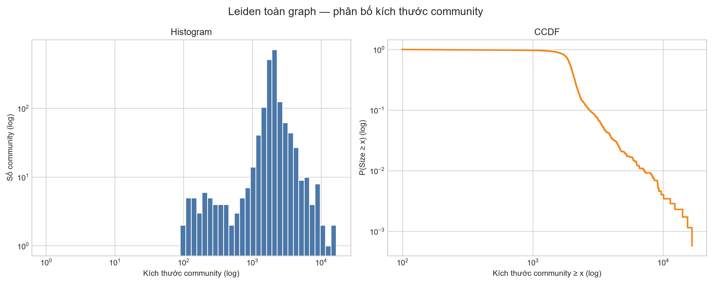
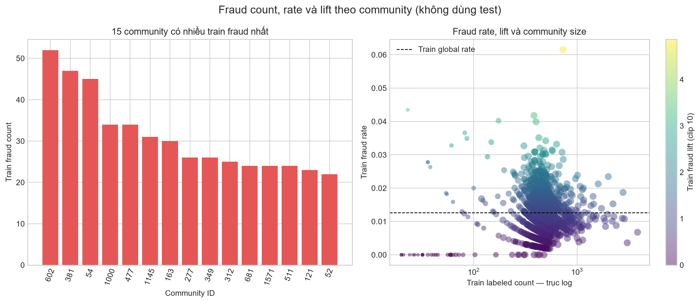
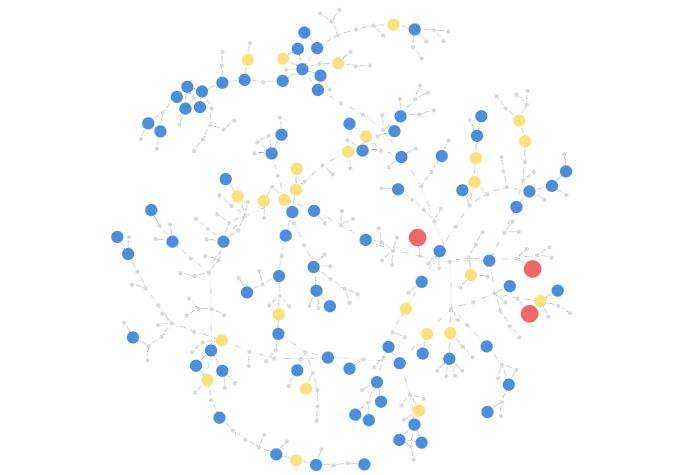
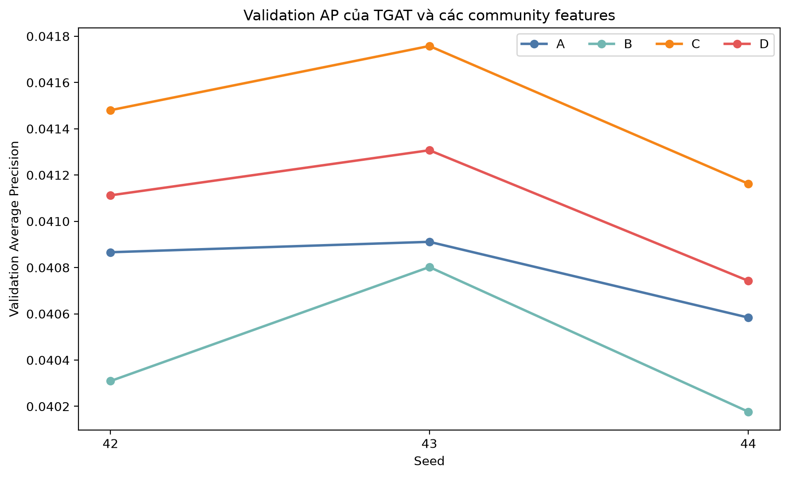
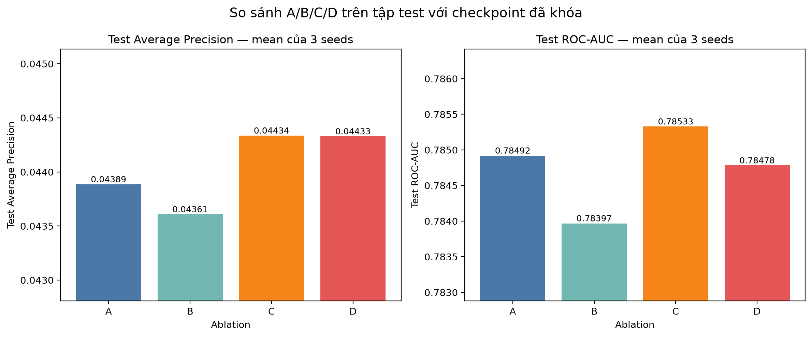

# Sprint 4 — Community Detection để bổ trợ Fraud Detection

## 1. Mục tiêu và kết luận ngắn

Sprint 4 trả lời ba câu hỏi:

1. Graph DGraphFin có cấu trúc community rõ hay không?
2. Fraud có tập trung trong một số community hay không?
3. Các đặc trưng community có giúp TGAT — mô hình tốt nhất của Sprint 3 — tăng metric hay không?

Kết quả chính:

1. **Graph có cấu trúc community rất rõ:** Leiden đạt modularity `0,994726` và coverage
   `0,995465`.
2. **Fraud có tập trung nhưng tín hiệu chưa ổn định mạnh:** top 5 risky communities có validation
   lift `3,866×` nhưng chỉ chứa `0,77%` fraud; toàn bộ 51 community đạt điều kiện train-only có
   lift `1,465×` và chứa `3,57%` fraud.
3. **Năm đặc trưng cấu trúc chưa giúp TGAT:** biến thể B thấp hơn TGAT gốc trên validation và test.
4. **Community-risk giúp một lượng nhỏ:** biến thể C được chọn bằng validation và cao hơn TGAT gốc
   trên test ở cả `3/3` seed. Test AP trung bình tăng từ `0,043885` lên `0,044336`, chênh
   `+0,000451`, tương đương khoảng `+1,03%`.

Kết luận phù hợp với bằng chứng hiện có:

> Community Detection không thay thế TGAT. Community-risk tạo từ nhãn train cung cấp thêm một tín
> hiệu nhỏ khi được đưa vào lớp dự đoán cuối của TGAT. Năm đặc trưng cấu trúc đang dùng chưa cho
> thấy lợi ích độc lập đáng tin cậy.

## 2. Graph có community hay không?

- Dataset SHA-256:
  `95470dab2c48523f7118a92204c090de37a957bb053bd5841c7bdba09558ba85`.
- Graph có `3.700.550` node, `3.997.260` cặp cạnh vô hướng duy nhất và `7.994.520` cạnh hai chiều
  sau khi gộp cạnh trùng.
- Leiden chỉ nhận cấu trúc graph; thuật toán không nhận nhãn, data split hoặc dự đoán của model.
- Cấu hình: modularity objective, resolution `1.0`, seed `42`, 2 iterations.
- Kết quả có `1.739` community; median size `1.964`, max size `16.609`.

| Structural metric | Giá trị |
|---|---:|
| Modularity | 0,994726 |
| Coverage | 0,995465 |
| Median conductance | 0,003653 |
| p90 conductance | 0,007008 |
| Median internal-edge ratio | 0,996347 |

Modularity và coverage rất cao, đồng thời conductance thấp và internal-edge ratio cao. Các kết quả
này cho thấy phần lớn cạnh nằm bên trong community và partition Leiden phản ánh một cấu trúc graph
rõ ràng.



## 3. Fraud phân bố ra sao giữa các community?

Một community được đánh dấu là risky chỉ từ tập train khi thỏa tất cả điều kiện:

- community size ≥ 20;
- có ít nhất 20 node train đã gán nhãn;
- có ít nhất 2 fraud node trong train;
- train fraud lift ≥ 2;
- internal-edge ratio ≥ 0,5.

Có 51 community đạt các điều kiện này. Tập validation chỉ được dùng sau đó để kiểm tra xem tín hiệu
fraud có tiếp tục xuất hiện trên dữ liệu chưa dùng để tạo risky rule hay không.

| Phạm vi | Số community | Validation labels | Validation fraud | Lift | Fraud capture |
|---|---:|---:|---:|---:|---:|
| Toàn bộ community đạt điều kiện | 51 | 4.477 | 83 | 1,465× | 3,57% |
| Top 5 đã chọn từ train | 5 | 368 | 18 | 3,866× | 0,77% |



Community `1544` được chọn để minh họa vì có kích thước tương đối nhỏ (`338` node), chỉ có
`1` cạnh biên so với `352` cạnh nội bộ, và có fraud lift trên train đạt `2,891×`. Hình Neo4j dưới
đây hiển thị toàn bộ community: đỏ là 3 fraud đã biết từ train, xanh là 79 normal từ train, vàng
là 26 node validation/test đã chủ động ẩn nhãn thật, và xám là 230 node nền.



Hình cho thấy community 1544 gần như tách biệt về mặt cấu trúc và các fraud train nằm trong cùng
community nhưng không tạo thành một cụm fraud hoàn toàn riêng biệt. Đây là hình minh họa cấu trúc;
kết luận định lượng vẫn dựa trên fraud rate, lift và các thí nghiệm ablation.

Kết quả cho thấy fraud có tập trung ở một số community, nhưng phạm vi bao phủ còn nhỏ. Vì vậy các
community này nên được xem là vùng ứng viên rủi ro, không phải bằng chứng rằng các node trong
community có hành vi gian lận phối hợp.

**Độ ổn định train–validation.** Trên 1.704 community có ít nhất 20 label ở cả hai split,
Spearman correlation giữa train và validation fraud rate là `0,089`. Tín hiệu fraud ở cấp
community nhìn chung còn khá nhiễu, dù một số community top đầu vẫn có validation lift cao.

## 4. Cách tạo community-risk mà không làm lộ nhãn

Community-risk được tạo theo các nguyên tắc sau:

1. Chỉ nhãn của tập train được dùng để tính fraud rate của community.
2. Khi tạo feature cho một train node, nhãn của chính node đó được loại khỏi phép tính.
3. Community-risk không được đưa vào các lớp TGAT dùng để tổng hợp thông tin từ hàng xóm.
4. Sau khi TGAT tạo embedding cho seed node, risk của chính seed node mới được nối vào embedding
   ngay trước classifier — lớp dự đoán fraud cuối cùng.

Điểm 3 và 4 ngăn nhãn của target quay lại thông qua feature của node hàng xóm. Structural features
không dùng nhãn nên vẫn có thể đi qua các lớp TGAT như feature thông thường.

## 5. So sánh TGAT với các community features

Bốn biến thể được thiết kế để tách riêng đóng góp của structural community features và
community-risk:

### A — TGAT baseline

A là mô hình tốt nhất từ Sprint 3 và không sử dụng community feature:

- Input TGAT: 34 base features của node.
- TGAT tổng hợp thông tin từ hàng xóm và tạo node embedding.
- Embedding được đưa vào classifier để dự đoán fraud.

```text
34 base features → TGAT → classifier → fraud probability
```

### B — TGAT + community structural features

B thêm năm đặc trưng mô tả cấu trúc community:

1. `log_community_size`: log của số node trong community.
2. `log_internal_edge_count`: log của số cạnh nằm hoàn toàn bên trong community.
3. `internal_density`: mức độ dày đặc của các cạnh bên trong community.
4. `node_internal_degree_ratio`: tỷ lệ cạnh của node nối đến node cùng community.
5. `community_conductance`: mức độ community kết nối ra phần graph bên ngoài.

Năm feature này không sử dụng nhãn. Chúng được chuẩn hóa bằng thống kê của train nodes rồi nối với
34 base features, làm input TGAT tăng từ 34 lên 39 chiều:

```text
34 base features + 5 structural features → TGAT → classifier → fraud probability
```

B trả lời câu hỏi: cung cấp trực tiếp thông tin cấu trúc community có giúp TGAT tốt hơn baseline
hay không?

### C — TGAT + community-risk

C không dùng năm structural features. TGAT vẫn nhận đúng 34 base features như A. Sau khi TGAT tạo
embedding cho seed node, một giá trị community-risk của chính seed node được nối vào embedding ngay
trước classifier:

```text
34 base features → TGAT → seed-node embedding + community-risk → classifier
```

Community-risk là fraud rate của community được tính chỉ từ nhãn train. Với một train node, nhãn
của chính node đó được loại khỏi phép tính. Với validation/test node, risk vẫn chỉ được tính từ
train labels. Risk không đi qua quá trình tổng hợp hàng xóm.

C trả lời câu hỏi: thông tin về mức độ tập trung fraud trong community có bổ sung tín hiệu mà TGAT
chưa học được từ base features và graph structure hay không?

### D — TGAT + structural features + community-risk

D kết hợp B và C:

- 34 base features và 5 structural features tạo input 39 chiều cho TGAT.
- Sau khi TGAT tạo seed-node embedding, community-risk được nối vào ngay trước classifier.

```text
34 base features + 5 structural features → TGAT
                                            ↓
                         seed-node embedding + community-risk → classifier
```

D trả lời câu hỏi: khi đã có community-risk, năm structural features có mang lại thêm lợi ích hay
không?

| Biến thể | Input đi qua TGAT | Feature nối trước classifier |
|---|---|---|
| A | 34 base features | Không có |
| B | 34 base + 5 structural features | Không có |
| C | 34 base features | 1 community-risk |
| D | 34 base + 5 structural features | 1 community-risk |

Để so sánh công bằng, A/B/C/D dùng cùng các seed `42`, `43`, `44`. Với cùng một seed, phần trọng số
TGAT dùng chung của B/C/D được khởi tạo giống A; trọng số dành cho feature mới bắt đầu từ 0.
Checkpoint của mỗi lần chạy được chọn bằng validation AP. Tập test không tham gia huấn luyện hoặc
lựa chọn checkpoint.

## 6. Kết quả validation

| Variant | Validation AP mean ± std | Δ AP so với A cùng seed | Seed cải thiện |
|---|---:|---:|---:|
| A — TGAT | 0,040787 ± 0,000145 | 0 | — |
| B — structural | 0,040429 ± 0,000269 | −0,000358 | 0/3 |
| C — community-risk | 0,041467 ± 0,000243 | +0,000680 | 3/3 |
| D — structural + community-risk | 0,041054 ± 0,000234 | +0,000267 | 3/3 |

| Seed | A | B | C | D |
|---:|---:|---:|---:|---:|
| 42 | 0,040866 | 0,040309 | 0,041480 | 0,041112 |
| 43 | 0,040911 | 0,040802 | 0,041758 | 0,041307 |
| 44 | 0,040584 | 0,040177 | 0,041162 | 0,040743 |

C được chọn trước khi xem test vì có validation AP cao nhất. B thấp hơn A ở cả ba seed; D cao hơn A
nhưng thấp hơn C ở cả ba seed.



## 7. Kết quả trên tập test

Trước khi đánh giá test, notebook lưu SHA-256 của 12 checkpoint A/B/C/D vào
`sprint4_community_ablation_final_lock.json`. Sau bước này, model, feature và hyperparameter không
được thay đổi. Tập test chỉ dùng để báo cáo khả năng tổng quát hóa của các checkpoint đã chọn từ
validation, không dùng để bắt đầu một vòng lựa chọn model mới.

| Variant | Test AP mean ± std | Δ AP so với A | Seed AP cao hơn A | Test ROC-AUC mean | Δ AUC so với A |
|---|---:|---:|---:|---:|---:|
| A — TGAT | 0,043885 ± 0,000303 | 0 | — | 0,784920 | 0 |
| B — structural | 0,043608 ± 0,000378 | −0,000277 | 1/3 | 0,783969 | −0,000951 |
| C — community-risk | **0,044336 ± 0,000333** | **+0,000451** | **3/3** | **0,785328** | **+0,000408** |
| D — structural + community-risk | 0,044329 ± 0,000225 | +0,000443 | 3/3 | 0,784782 | −0,000138 |

| Seed | A AP | B AP | C AP | D AP |
|---:|---:|---:|---:|---:|
| 42 | 0,043759 | 0,043812 | 0,044531 | 0,044317 |
| 43 | 0,044303 | 0,043934 | 0,044610 | 0,044610 |
| 44 | 0,043594 | 0,043078 | 0,043867 | 0,044059 |




## 8. Nhận xét từ kết quả thí nghiệm

Kết quả ablation cho thấy việc thêm trực tiếp năm structural community features không cải thiện
TGAT. Một khả năng là TGAT đã học được phần lớn thông tin topology này thông qua quá trình tổng hợp
hàng xóm; ablation hiện tại chưa tách riêng được nguyên nhân. Ngược lại, community-risk cung cấp
thông tin từ nhãn train mà TGAT không có trực tiếp trong graph structure, nên C cải thiện AP một
lượng nhỏ nhưng nhất quán. D gần như bằng C, cho thấy phần lợi ích chủ yếu đến từ community-risk chứ
chưa có bằng chứng rằng structural features mang thêm giá trị.

Cụ thể:

- B thấp hơn A trên cả validation và test. Kết quả này chỉ cho thấy **năm structural features hiện
  tại** chưa bổ sung giá trị cho TGAT; không đủ để kết luận mọi thông tin community structure đều
  vô ích.
- C được chọn bằng validation và tiếp tục cao hơn A trên test ở `3/3` seed. Test AP tăng
  `+0,000451`, tương đương khoảng `+1,03%`, nên đây là một cải thiện nhỏ chứ không phải bước nhảy lớn.
- D cao hơn A nhưng gần như bằng C trên test; chênh lệch AP giữa C và D chỉ khoảng `0,000007`.
  Vì vậy chưa có bằng chứng rằng thêm structural features bên cạnh community-risk mang lại lợi ích.
- Community Detection không thay thế TGAT. TGAT vẫn tạo representation chính; community-risk chỉ
  bổ sung một tín hiệu vào lớp dự đoán cuối.
- Đây là kết quả trên một graph DGraphFin và một Leiden resolution. Chưa có confidence interval,
  significance test, multiple-resolution hoặc random-partition comparison, nên không nên khái quát
  rằng community-risk luôn cải thiện mọi mô hình hay mọi dataset.

## 9. Artifact và cách chạy lại

- `notebooks/04_community_detection.ipynb`: Leiden, EDA và tạo community features.
- `notebooks/05_community_ablation.ipynb`: so sánh A/B/C/D đủ ba seed và trực quan hóa kết quả.
- `artifacts/figures/neo4j/community_1544_visualisation.png`: hình Neo4j của community 1544.
- `artifacts/metrics/sprint4_community_ablation_final_lock.json`: hash 12 checkpoint trước test.
- `artifacts/metrics/sprint4_community_ablation.json`: validation và test metrics của A/B/C/D.
- `artifacts/metrics/sprint4_community_ablation_test_predictions.npz`: test prediction đã lưu.
- Raw checkpoint nằm trong `artifacts/runs/sprint4_community_ablation_*`.

Các cờ chạy trong notebook mặc định tắt. Dùng `RUN_COMMUNITY_ABLATION_TRAIN=1` để train hoặc tái sử
dụng kết quả B/C/D đủ ba seed. Chỉ dùng `RUN_COMMUNITY_ABLATION_TEST=1` khi cần thực hiện lần đánh
giá test đã khóa; nếu kết quả test đã tồn tại, notebook sẽ đọc lại thay vì đánh giá lần nữa.
