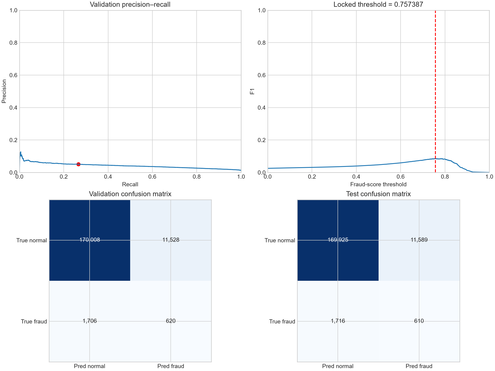
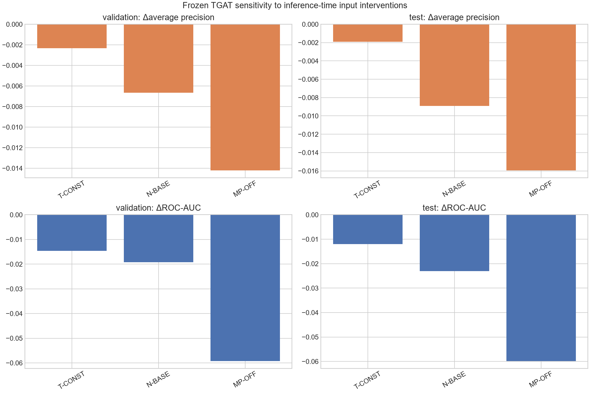
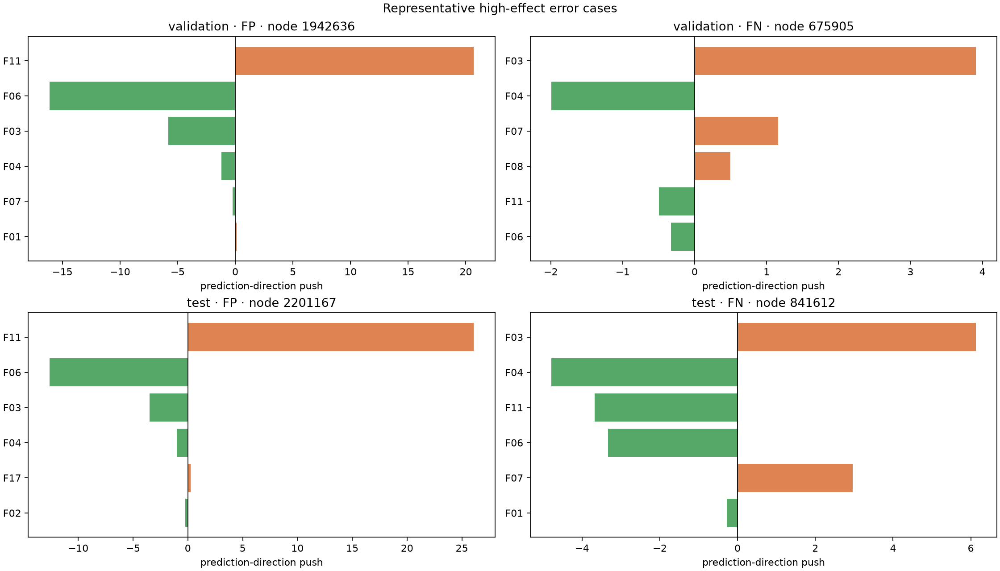

# Sprint 5.2 — Phân tích dự đoán sai và kiểm chứng tín hiệu TGAT

Sprint 5 cho thấy GNNExplainer có thể mô tả các pattern feature mà model chú ý đến,
nhưng chưa trả lời trực tiếp hai câu hỏi:

1. Khi model cảnh báo nhầm hoặc bỏ sót fraud, feature nào đang hỗ trợ phía dự đoán sai?
2. TGAT thật sự nhạy với thời gian, nội dung hàng xóm và message passing đến mức nào?

Sprint 5.2 trả lời bằng hai lớp bằng chứng bổ sung cho nhau:

- **direct attribution**: thay từng feature rồi chạy lại model giữ nguyên;
- **thử thay đổi đầu vào**: thay đổi riêng thời gian, feature hàng xóm và message
  passing trên toàn bộ validation/test.

Kết luận ngắn gọn là: các feature nổi bật trong FP/FN phần lớn cũng xuất hiện ở control
cùng phía dự đoán, nên chưa có feature riêng của lỗi ở cấp nhóm; message passing và nội
dung hàng xóm vẫn ảnh hưởng mạnh đến dự đoán.

## 1. Chọn threshold để xác định TP, FP, FN và TN

Model được giữ nguyên là **TGAT + community-risk, variant C, seed 42** đã chọn từ
Sprint 4. Model dự đoán nhãn fraud/normal cho từng node bằng feature và các event liên
kết trực tiếp.

**Precision** cho biết trong các cảnh báo fraud có bao nhiêu cảnh báo đúng. **Recall**
cho biết model tìm được bao nhiêu trong tổng số fraud thật. **F1** cân bằng hai con số
này; Sprint 5.2 dùng F1 để chọn ngưỡng vì chưa có chi phí nghiệp vụ cụ thể.

Model cho mỗi node một fraud score từ 0 đến 1. Để đổi score thành dự đoán, ta cần một
ngưỡng: score bằng hoặc cao hơn ngưỡng được gọi là fraud, thấp hơn ngưỡng được gọi là
normal. Sprint 5.2 thử 182.612 ngưỡng khác nhau trên validation và chọn ngưỡng cho F1
cao nhất. Kết quả là:

> **fraud score ≥ 0,75738740 → dự đoán fraud**

Con số 0,75738740 đến từ kết quả validation, không phải một ngưỡng được chọn thủ công.
Nó cũng không có nghĩa node chắc chắn có 75,7% xác suất fraud vì chưa kiểm tra fraud
score có khớp với xác suất thực tế hay không. Sau khi chọn xong, ngưỡng này được giữ
nguyên khi tính kết quả test.

Cách chọn ngưỡng, node phân tích và các phép kiểm tra đều được ghi lại trước khi đọc
kết quả test. Tuy nhiên test đã từng được xem ở Sprint 4 và Sprint 5, nên nó chỉ dùng để
kiểm tra kết quả có lặp lại hay không, không còn là một tập hoàn toàn mới chưa từng xem.

Bốn nhóm trong bảng được hiểu như sau:

- **TP**: fraud được model cảnh báo đúng;
- **FP**: normal nhưng bị cảnh báo nhầm là fraud;
- **FN**: fraud bị model bỏ sót và dự đoán là normal;
- **TN**: normal được model dự đoán đúng.

| Tập | N | Positive thật | TP | FP | FN | TN | Precision | Recall | F1 | AP | ROC-AUC |
|---|---:|---:|---:|---:|---:|---:|---:|---:|---:|---:|---:|
| Validation | 183.862 | 2.326 | 620 | 11.528 | 1.706 | 170.008 | 0,0510 | 0,2666 | 0,0857 | 0,0415 | 0,7817 |
| Test | 183.840 | 2.326 | 610 | 11.589 | 1.716 | 169.925 | 0,0500 | 0,2623 | 0,0840 | 0,0445 | 0,7856 |

Hai split cho kết quả gần nhau. Model tìm được khoảng 26% fraud, nhưng chỉ khoảng 5%
cảnh báo positive là đúng. Nói cách khác, threshold tối đa F1 vẫn tạo rất nhiều cảnh
báo nhầm và bỏ sót phần lớn fraud. Đây là lý do Sprint 5.2 không chỉ giải thích các node
điểm cao/thấp như Sprint 5, mà chuyển sang phân tích trực tiếp FP và FN.

## 2. Feature nào thực sự gắn riêng với dự đoán sai?

Phân tích sâu chọn 20 FP và 20 FN trên mỗi split, tổng cộng 80 dự đoán sai. Trong mỗi
nhóm, một nửa là lỗi gần threshold và một nửa là lỗi model tự tin nhất. Tuy nhiên, chỉ
nhìn FP hoặc FN chưa đủ: một feature nổi bật có thể là feature model luôn dùng khi dự
đoán fraud hoặc normal, chứ không phải feature gắn riêng với lỗi.

### Vì sao cần control?

- **Error** là node model dự đoán sai, gồm FP và FN.
- **Control** là node model dự đoán đúng nhưng có cùng lớp dự đoán với error. Vì vậy,
  FP được so với TP, còn FN được so với TN.

Control giúp kiểm tra một feature có thật sự nổi bật riêng ở dự đoán sai hay chỉ là
feature model thường sử dụng cho mọi node được dự đoán cùng lớp. Nếu feature tác động
tương tự ở cả error và control, ta chưa thể xem nó là feature gắn riêng với lỗi.

### Đo tác động của từng feature

Với mỗi node, ta thay riêng feature `i` bằng mức tham chiếu rồi chạy lại model. Gọi
`z_gốc` là fraud logit trước khi thay và `z_tham_chiếu(i)` là logit sau khi thay:

- FP và TP: `prediction_push(i) = z_gốc - z_tham_chiếu(i)`;
- FN và TN: `prediction_push(i) = z_tham_chiếu(i) - z_gốc`.

Nhờ đổi chiều phép trừ ở nhóm dự đoán normal, `prediction_push > 0` luôn có nghĩa
feature ban đầu đang hỗ trợ phía dự đoán hiện tại của model. Với error, đó là phía dự
đoán sai; với control, đó là phía dự đoán đúng.

Mức tham chiếu là 0 cho F01–F17 và các cờ missing, còn community-risk dùng fraud rate
của tập train. Vì các feature không được chuẩn hóa, 0 chỉ là một mốc so sánh cố định,
không được hiểu là giá trị trung bình, trạng thái trung tính hay thao tác xóa feature.

### So sánh error với control trong từng cặp

Với mỗi feature, báo cáo tính:

`chênh lệch theo cặp = prediction_push của error − prediction_push của control`.

- số dương: feature hỗ trợ phía dự đoán mạnh hơn ở error;
- gần 0: feature tác động tương tự ở error và control;
- số âm: feature hỗ trợ phía dự đoán mạnh hơn ở control.

Để được xem là feature gắn với dự đoán sai ở cấp nhóm, feature phải đồng thời thỏa hai
điều kiện:

1. `Push error trung vị > 0`: feature hỗ trợ phía dự đoán sai trên một error điển hình.
2. `Chênh lệch trung vị > 0`: mức hỗ trợ đó mạnh hơn ở error so với control.

Chỉ có chênh lệch dương là chưa đủ. Ví dụ, nếu push ở error là -0,03 và ở control là
-0,05 thì chênh lệch vẫn bằng +0,02, nhưng feature thực tế đang chống lại dự đoán sai ở
error. Bảng dưới vì vậy chỉ thống kê feature đạt cả hai điều kiện, thay vì chọn theo độ
lớn tuyệt đối của chênh lệch.

| Tập | Cặp | Feature đạt cả hai điều kiện | Push error trung vị | Chênh lệch trung vị | Tỷ lệ cặp có chênh lệch > 0 |
|---|---|---|---:|---:|---:|
| Validation | FP–TP | Không có | — | — | — |
| Test | FP–TP | F16-missing | 0,0138 | 0,0008 | 50% |
| Validation | FN–TN | Không có | — | — | — |
| Test | FN–TN | community-risk | 0,0259 | 0,0201 | 55% |

Trên test, `F16-missing` đạt điều kiện cho FP–TP và `community-risk` đạt điều kiện cho
FN–TN. Tuy nhiên, chúng không đạt lại điều kiện trên validation; chênh lệch cũng nhỏ và
chỉ dương ở khoảng một nửa số cặp. Vì vậy chưa có feature nào cho thấy khả năng hỗ trợ
dự đoán sai ổn định trên cả hai split. Attribution vẫn hữu ích để giải thích từng error
riêng lẻ, nhưng chưa đủ bằng chứng để kết luận một pattern chung cho FP hoặc FN.

## 3. Community-risk ảnh hưởng đến dự đoán sai như thế nào?

Community-risk được tính từ nhãn train trong Leiden community và được dùng cùng các
feature khác sau khi model đã tổng hợp thông tin hàng xóm. Mức tham chiếu của feature
này là fraud rate toàn tập train; 34 feature còn lại dùng mức tham chiếu 0.

Trong bảng dưới, **IQR** là khoảng chứa 50% target ở giữa. Nếu IQR đi qua 0, tác động
không cùng một hướng trên phần lớn node trong nhóm: feature hỗ trợ dự đoán ở một số node nhưng
có thể chống lại hoặc gần như không ảnh hưởng ở node khác.

| Tập/nhóm | Median prediction push | IQR | Tỷ lệ push > 0 |
|---|---:|---|---:|
| Validation FP | 0,0056 | [-0,0546; 0,0463] | 55% |
| Validation FN | -0,0146 | [-0,0753; 0,0729] | 40% |
| Test FP | 0,0231 | [-0,0120; 0,0554] | 65% |
| Test FN | 0,0259 | [-0,1027; 0,0820] | 70% |

Với FP, median effect dương trên cả validation và test nhưng có độ lớn nhỏ; IQR đều
đi qua 0. Quan trọng hơn, khi trừ TP control, chênh lệch trung vị là -0,0358 trên
validation và -0,0989 trên test: community-risk hỗ trợ dự đoán fraud mạnh hơn ở TP.
Với FN, chênh lệch so với TN control dương khoảng 0,02 trên cả hai split, nhưng effect
ngay trong FN lại đổi dấu giữa validation và test. Vì vậy community-risk chưa cho thấy
một tác động riêng của lỗi đủ rõ và nhất quán.

## 4. TGAT phụ thuộc vào thời gian và thông tin hàng xóm như thế nào?

Phân tích feature ở trên tập trung vào 80 FP/FN target đã chọn. Để kiểm tra hành vi của
model trên phạm vi rộng hơn, Sprint 5.2 chạy bốn cấu hình trên toàn bộ validation và
test, dùng cùng một model và cùng cách lấy hàng xóm:

| ID | Thay đổi gì? | Vẫn giữ nguyên gì? |
|---|---|---|
| FULL | Không thay đổi | Toàn bộ đầu vào |
| T-CONST | Đưa thời gian của các event quanh target về cùng mức trung vị | Node, liên kết và hàng xóm |
| N-BASE | Đưa feature hàng xóm về mức tham chiếu | Feature target, liên kết và thời gian |
| MP-OFF | Không truyền thông tin từ hàng xóm vào target | Feature target, classifier và community-risk |

Trong các phép thử này, model không được train lại; ta chỉ thay đầu vào lúc dự đoán và
xem kết quả thay đổi ra sao. Vì vậy bảng dưới cho biết model hiện tại nhạy với thành
phần nào, không cho biết một model mới được train với thay đổi đó sẽ tốt hay xấu.

AP và ROC-AUC đều đánh giá khả năng xếp node fraud cao hơn node normal mà không phụ
thuộc vào một threshold cụ thể. AP phù hợp với dữ liệu mất cân bằng mạnh; ROC-AUC được
giữ để nhất quán với cách đánh giá model ở các sprint trước. `ΔAP` và `ΔROC-AUC` là
mức thay đổi so với FULL; số âm nghĩa là khả năng xếp hạng giảm.

### Kết quả trên toàn bộ validation và test

| Tập | Cấu hình | AP | ΔAP | ROC-AUC | ΔROC-AUC |
|---|---|---:|---:|---:|---:|
| Validation | FULL | 0,04148 | — | 0,78168 | — |
| Validation | T-CONST | 0,03916 | -0,00233 | 0,76707 | -0,01461 |
| Validation | N-BASE | 0,03483 | -0,00665 | 0,76243 | -0,01925 |
| Validation | MP-OFF | 0,02726 | -0,01422 | 0,72245 | -0,05923 |
| Test | FULL | 0,04453 | — | 0,78558 | — |
| Test | T-CONST | 0,04261 | -0,00192 | 0,77361 | -0,01197 |
| Test | N-BASE | 0,03562 | -0,00891 | 0,76254 | -0,02304 |
| Test | MP-OFF | 0,02857 | -0,01596 | 0,72576 | -0,05982 |

### Sự khác nhau về thời gian có đóng góp

T-CONST đưa mọi event quanh một target về cùng mức thời gian. So với FULL, AP giảm
0,00233 và ROC-AUC giảm 0,01461 trên validation; trên test, hai mức giảm tương ứng là
0,00192 và 0,01197. Kết quả cùng giảm trên cả hai split cho thấy model có sử dụng sự
khác nhau về thời gian giữa các event. Phép thử này không đủ để kết luận model đã học
đúng thứ tự thời gian chi tiết.

### Nội dung hàng xóm có đóng góp rõ ràng

N-BASE đưa feature hàng xóm về mức tham chiếu nhưng vẫn giữ feature target, liên kết và
thời gian. AP giảm 0,00665 trên validation và 0,00891 trên test; ROC-AUC giảm tương ứng
0,01925 và 0,02304. TGAT vì thế không chỉ đọc feature target hoặc số liên kết mà còn sử
dụng nội dung feature của hàng xóm.

### Thông tin từ hàng xóm quyết định phần lớn cảnh báo fraud

MP-OFF không cho thông tin từ hàng xóm đi vào target và tạo thay đổi lớn nhất:

- validation AP giảm 0,01422 và ROC-AUC giảm 0,05923;
- test AP giảm 0,01596 và ROC-AUC giảm 0,05982.

Đây là mức giảm lớn nhất trong ba ablation trên cả hai split. Kết quả cho thấy thông tin
được truyền từ hàng xóm là thành phần quan trọng nhất trong khả năng xếp hạng fraud của
model.

Một kiểm tra kỹ thuật xác nhận MP-OFF vẫn giữ feature target và community-risk hoạt
động; chỉ thông tin truyền từ hàng xóm bị tắt. Vì vậy mức giảm trên không phải do vô
tình loại bỏ toàn bộ model.

## 5. Minh họa bốn trường hợp dự đoán sai

Hình dưới chọn một FP và một FN trên mỗi split. Đây là các node mà việc thay feature
làm điểm model thay đổi mạnh, nên chúng giúp nhìn rõ model đang phản ứng với đầu vào
như thế nào.

Các node này chỉ là ví dụ minh họa, không đại diện cho toàn bộ FP hoặc FN. Khi đọc một
ví dụ, cần xem cả hai kết quả: feature nào làm điểm đổi mạnh khi thay trực tiếp và
feature nào được GNNExplainer xếp cao. Nếu hai cách không đồng ý, không nên dựa vào một
bảng xếp hạng duy nhất để kết luận.

Một feature đứng đầu chỉ cho biết model đang chú ý đến đầu vào đó. Nó không chứng minh
feature đó là dấu hiệu gian lận trong nghiệp vụ thực tế.

## 6. Các kết luận chính

### Vì sao model dự đoán sai?

Không có feature nào vừa hỗ trợ phía dự đoán sai, vừa hỗ trợ mạnh hơn control, rồi lặp
lại kết quả đó trên cả validation và test. `F16-missing` chỉ đạt hai điều kiện ở FP trên
test; `community-risk` chỉ đạt ở FN trên test. Vì vậy kết quả mạnh nhất nằm ở giải thích
từng error, chưa phải một pattern chung có thể phân biệt error với dự đoán đúng cùng lớp.

Community-risk có effect nhỏ và không đồng nhất trong FP/FN. Nó là một tín hiệu bổ
sung, không phải lời giải thích chung cho error.

### TGAT đã học gì?

TGAT phụ thuộc rõ vào thông tin từ hàng xóm. Đưa feature hàng xóm về mức tham chiếu làm
AP và ROC-AUC giảm trên cả validation và test; bỏ toàn bộ thông tin truyền từ hàng xóm
tạo mức giảm lớn nhất. Model cũng sử dụng sự khác nhau về thời gian giữa các event,
nhưng mức giảm do T-CONST nhỏ hơn hai ablation liên quan đến hàng xóm. Vì vậy bằng chứng
về vai trò của thông tin hàng xóm mạnh hơn bằng chứng về vai trò của thời gian.

## 7. Giới hạn thí nghiệm

1. **Ngưỡng chưa dựa trên chi phí thực tế.** Ngưỡng hiện tại tối đa F1 trên validation,
   nhưng doanh nghiệp có thể chịu chi phí cảnh báo nhầm và bỏ sót fraud khác nhau. Bước
   tiếp theo nên chọn ngưỡng theo số cảnh báo có thể xử lý và chi phí thực tế.
2. **Feature F01–F17 bị ẩn danh.** Report không tự gán ý nghĩa nghiệp vụ cho các mã này;
   cần data dictionary mới chuyển được pattern thành giả thuyết điều tra.

## Artifact tái lập

- `artifacts/metrics/sprint5_2_protocol_lock.json`: model/data hash, threshold rule,
  target selection và ablation protocol.
- `artifacts/metrics/sprint5_2_predictions.csv.gz`: 367.702 prediction validation/test.
- `artifacts/metrics/sprint5_2_threshold_curve.csv.gz`: toàn bộ 182.612 threshold ứng viên.
- `artifacts/metrics/sprint5_2_targets.csv`: metadata của các target dùng để chạy attribution.
- `artifacts/metrics/sprint5_2_validation_target_batches.npz` và
  `sprint5_2_test_target_batches.npz`: frozen local batch.
- `artifacts/metrics/sprint5_2_error_attribution.json`: attribution theo từng target,
  bảng tổng hợp và chênh lệch trong 80 cặp error–control.
- `artifacts/metrics/sprint5_2_error_attribution_arrays.npz`: direct effect và mask dạng mảng.
- `artifacts/metrics/sprint5_2_ablation_results.json`: full-split metric, cohort result,
  paired bootstrap và technical gate.
- `artifacts/metrics/sprint5_2_ablation_predictions.npz`: logit từng variant và mapping
  của các phép hoán vị.
- `notebooks/07_tgat_error_analysis.ipynb`: notebook đã execute và trình bày toàn bộ
  kết quả Sprint 5.2.
