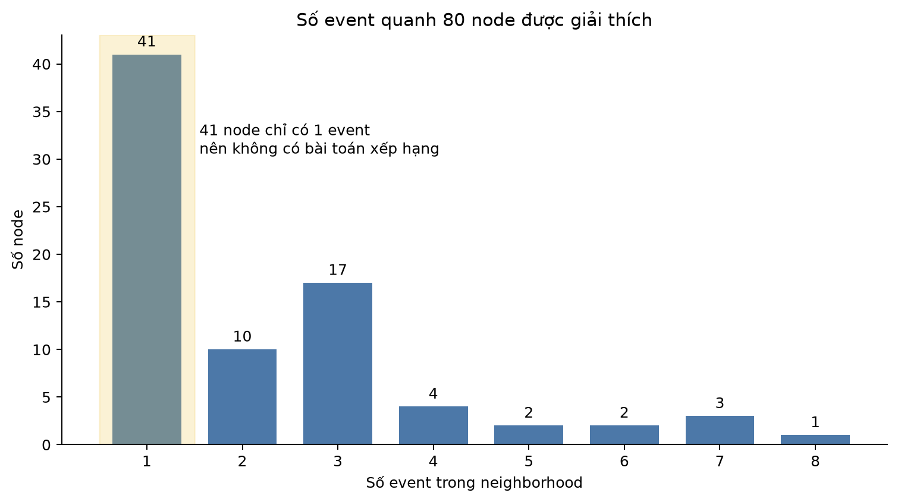
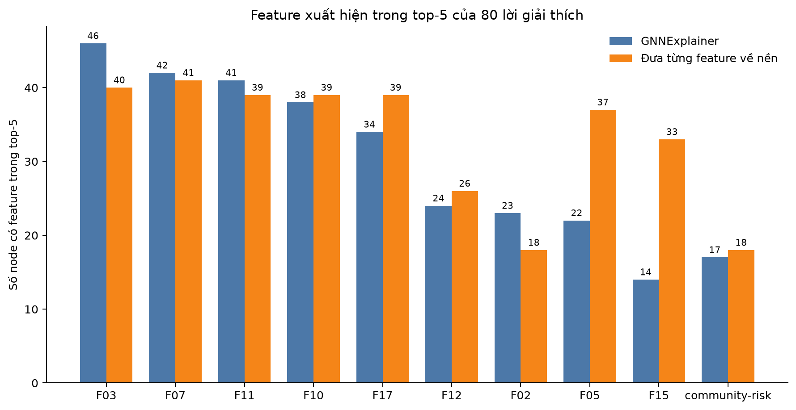
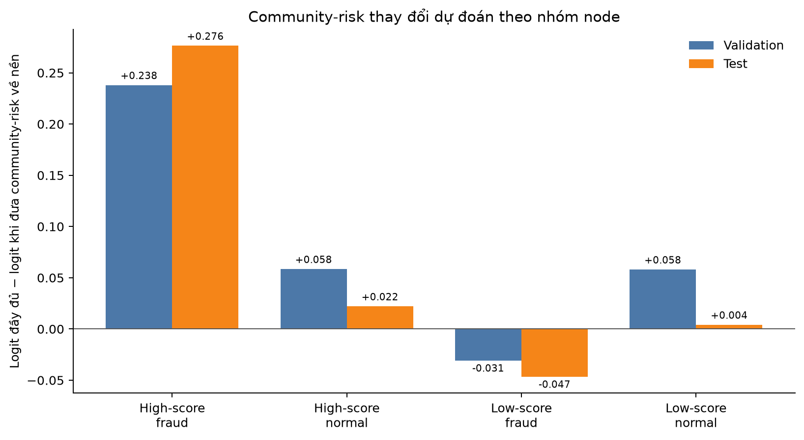
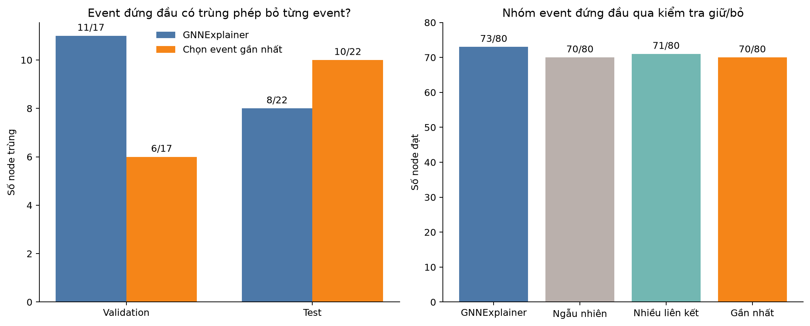

# Sprint 5 — Giải thích TGAT + community-risk bằng GNNExplainer

Các thí nghiệm ở Sprint trước cho thấy **TGAT + community-risk** có validation AP tốt
nhất trong các cấu hình đã so sánh, nên đây là mô hình được giải thích trong Sprint 5.
Câu hỏi của sprint là:

> **Mô hình dựa vào thông tin nào để đánh giá một node là đáng ngờ, và lời giải thích
> đó có đủ ổn định, đáng tin để sử dụng hay không?**

Ta dùng GNNExplainer để gán điểm cho hai phần đầu vào của từng dự đoán:

- **feature**: 35 giá trị mô tả node đang được giải thích, gồm F01–F17, 17 cờ báo giá trị bị thiếu và
  community-risk;
- **event**: một lần một user khai báo user khác làm liên hệ khẩn cấp, kèm thời gian. Hai node
  có thể nối với nhau bằng nhiều event khác nhau.

**Mask** là một hệ số tạm thời gắn với từng feature hoặc event, có giá trị từ 0 đến 1.
Giá trị càng gần 1 nghĩa là phần đầu vào đó được giữ lại nhiều hơn khi GNNExplainer
cố tái hiện dự đoán ban đầu; giá trị càng gần 0 nghĩa là ảnh hưởng của phần đó bị giảm
bớt. Tất cả mask bắt đầu ngang nhau ở 0,5, sau đó được điều chỉnh qua 50 lượt tối ưu.
Model đã huấn luyện được giữ nguyên; chỉ mask thay đổi.

GNNExplainer không tự tạo ra “đáp án đúng”. Vì thế sau khi nhận được thứ tự của nó, ta
kiểm tra lại bằng cách tác động trực tiếp lên đầu vào rồi chạy model lại:

1. đưa lần lượt từng feature về mức nền;
2. bỏ lần lượt từng event;
3. với nhóm event đứng đầu, thử **chỉ giữ nhóm đó** và **bỏ nhóm đó**;
4. so với các cách chọn đơn giản và kiểm tra độ ổn định.

Thí nghiệm dùng 80 node đã chọn theo quy tắc cố định: 40 validation và 40 test. Trong
mỗi tập có 10 fraud được model chấm cao, 10 normal được chấm cao, 10 fraud bị chấm
thấp và 10 normal điểm thấp làm nhóm so sánh. Cách chọn này giúp quan sát cả trường hợp
model làm tốt, cảnh báo nhầm và bỏ sót; 80 node không phải mẫu ngẫu nhiên đại diện cho
toàn bộ graph. Đây là lời giải thích cục bộ cho dự đoán, không phải bằng chứng rằng các
node tạo thành một fraud ring.

## 1. Model thực sự nhìn thấy graph lớn đến đâu?

TGAT nhìn các event nối trực tiếp với node cần dự đoán và lấy tối đa 15 event, nhưng
15 chỉ là mức trần. Trong 80 node, **41 node chỉ có một event**, **68 node có nhiều
nhất ba event**, và chỉ **39 node có từ hai event trở lên** để có thể so thứ tự event.
Phần graph cục bộ lớn nhất trong tập chính có tám event.

Điều này ảnh hưởng trực tiếp đến cách đọc kết quả. Với node chỉ có một event,
GNNExplainer không thật sự phải chọn giữa nhiều phương án. Khi quanh node chỉ có hai
hoặc ba event, một nhóm “quan trọng” đôi khi chính là gần như toàn bộ phần graph đó.

## 2. GNNExplainer chọn feature nào?

DGraphFin chỉ công bố các tên ẩn danh F01–F17, nên báo cáo không tự gán ý nghĩa như
“thu nhập” hay “số giao dịch” cho chúng. Các tên có hậu tố -missing là cờ báo feature
tương ứng bị thiếu. **Top-5** nghĩa là năm feature có điểm cao nhất cho một node.

Cột “đưa riêng feature về nền” là phép kiểm tra trực tiếp: với từng node, ta lần lượt
thay một feature bằng giá trị nền, chạy model lại và đo dự đoán thay đổi bao nhiêu.
Sau khi thử đủ 35 feature, năm feature làm dự đoán đổi nhiều nhất tạo thành top-5 của
phép kiểm tra này. Con số 40/80 của F03 nghĩa là F03 thuộc nhóm năm feature gây thay
đổi mạnh nhất ở 40 trong 80 node.

| Feature | GNNExplainer: số lần vào top-5 | Đưa riêng feature về nền: số lần vào top-5 |
|---|---:|---:|
| F03 | 46/80 | 40/80 |
| F07 | 42/80 | 41/80 |
| F11 | 41/80 | 39/80 |
| F10 | 38/80 | 39/80 |
| F17 | 34/80 | 39/80 |
| F12 | 24/80 | 26/80 |
| F02 | 23/80 | 18/80 |
| F05 | 22/80 | 37/80 |
| F15 | 14/80 | 33/80 |
| community-risk | 17/80 | 18/80 |

Hai cách không trùng hoàn toàn, nhưng cùng nhấn mạnh một nhóm gồm **F03, F07, F10,
F11 và F17**. GNNExplainer đưa F03 vào top-5 ở 46/80 node; phép đưa từng feature về
nền cũng cho thấy F03 thuộc top-5 ở 40/80 node. Kết quả trên validation và test khá
giống nhau: F03 xuất hiện nhiều nhất ở cả hai tập (22/40 và 24/40).

| Tập/nhóm | Năm feature xuất hiện nhiều nhất theo GNNExplainer | Năm feature xuất hiện nhiều nhất khi đưa từng feature về nền |
|---|---|---|
| Validation | F03 (22/40), F07 (21/40), F10 (20/40), F11 (20/40), F17 (18/40) | F07 (21/40), F03 (20/40), F10 (20/40), F17 (20/40), F11 (19/40) |
| Test | F03 (24/40), F07 (21/40), F11 (21/40), F10 (18/40), F17 (16/40) | F03 (20/40), F07 (20/40), F11 (20/40), F05 (19/40), F10 (19/40) |
| Fraud được model chấm cao | F17 (20/20), F11 (18/20), F05 (16/20), F02 (15/20), F01 (11/20) | F17 (20/20), F05 (19/20), F11 (19/20), F15 (16/20), F01 (12/20) |
| Normal được model chấm cao | F11 (20/20), F17 (14/20), F06 (11/20), F01 (7/20), F02 (7/20) | F11 (20/20), F17 (19/20), F05 (18/20), F15 (17/20), F01 (10/20) |
| Fraud bị model chấm thấp | F03 (20/20), F07 (20/20), F10 (18/20), F08 (10/20), F12 (9/20) | F03 (20/20), F07 (20/20), F10 (19/20), F08 (12/20), F12 (11/20) |
| Normal điểm thấp để so sánh | F03 (20/20), F07 (20/20), F10 (18/20), F12 (15/20), F08 (7/20) | F03 (20/20), F07 (20/20), F10 (17/20), F12 (15/20), F02 (8/20) |

Các nhóm node không dùng cùng một bộ feature. Nhóm fraud được model chấm cao nổi bật
với F17, F11, F05 và F02; community-risk cũng xuất hiện ở 11/20 node, bằng số lần của
F01. Nhóm fraud bị model chấm thấp lại tập trung vào F03, F07 và F10. Bảng này chỉ mô
tả đầu vào model thường chú ý trong từng nhóm, không gán ý nghĩa nghiệp vụ cho mã Fxx.

Ta dùng hai phép đo vì chúng trả lời hai câu hỏi khác nhau. **Spearman** so toàn bộ thứ
tự của 35 feature; trung vị **0,467** cho thấy hai cách chỉ đồng thuận
ở mức vừa phải. **Jaccard top-5** bỏ qua thứ tự và chỉ hỏi hai cách có chọn cùng năm
feature hay không. Trung vị **0,667** tương ứng với việc hai nhóm
top-5 thường có bốn feature chung trên tổng sáu feature khác nhau.

Vì vậy, kết luận đáng tin hơn là “F03, F07, F10, F11 và F17 thường nằm trong nhóm
feature quan trọng”. Ở một node cụ thể, không nên khẳng định feature đứng hạng 2 chắc
chắn quan trọng hơn feature hạng 3, nhất là khi điểm của chúng gần nhau và phép kiểm
tra trực tiếp có thể đổi thứ tự.

## 3. Community-risk đóng góp thế nào?

Community-risk là feature được tạo ở Sprint 4 từ nhãn train trong từng Leiden
community. Nó không đứng đầu ở mọi node. GNNExplainer đưa community-risk vào top-5 ở
**17/80** node và xếp hạng 1 ở **2/80**.
Khi community-risk được xếp cùng toàn bộ 34 đầu vào còn lại, hạng trung vị của nó là
**11,0** trên tổng số 35 feature.

Trong bảng dưới, **logit** là điểm thô của model trước khi chuyển thành fraud score từ
0 đến 1. Dùng điểm thô giúp thấy thay đổi rõ hơn khi fraud score đã ở rất gần 0 hoặc 1.

| Nhóm | Community-risk vào top-5 | Hạng trung vị | Logit đổi trung bình khi đưa về nền |
|---|---:|---:|---:|
| Fraud được model chấm cao | 11/20 | 5,0 | 0,257 |
| Normal được model chấm cao | 3/20 | 15,5 | 0,040 |
| Fraud bị model chấm thấp | 2/20 | 14,0 | -0,039 |
| Normal điểm thấp để so sánh | 1/20 | 12,0 | 0,031 |

“Đưa về nền” ở đây nghĩa là chỉ thay community-risk của node bằng mức chung được tính
từ tập train, giữ nguyên graph và 34 feature còn lại. Nếu điểm thô giảm sau khi thay,
community-risk ban đầu đang đẩy dự đoán về phía fraud. Ảnh hưởng rõ nhất nằm ở nhóm
fraud được model chấm cao: điểm thô giảm trung bình **0,257**. Với nhóm
fraud bị chấm thấp, thay đổi trung bình là âm nhẹ; community-risk không phải lúc nào
cũng đẩy fraud score lên.

GNNExplainer và phép thay community-risk về mức train cho cùng một kết luận ở cấp nhóm:
community-risk có vai trò rõ nhất ở một phần fraud được model chấm cao, chứ không phải
nguồn quyết định chung cho tất cả 80 node.

## 4. GNNExplainer chọn event nào?

Trong 39 node có thể xếp hạng, event đứng đầu của GNNExplainer cũng là event mới nhất
ở **20/39** trường hợp. Thời gian có liên hệ với thứ tự, nhưng
GNNExplainer không phải lúc nào cũng chọn event mới nhất.

Dữ liệu còn lưu mã edge_type từ 1 đến 11, nhưng ý nghĩa từng mã đã bị ẩn và TGAT
trong bài không sử dụng trường này để dự đoán. Vì vậy Sprint 5 không kết luận model
ưu tiên “event loại 4, 5 hay 6”; mã loại chỉ được giữ trong artifact để truy vết.

Tất cả **179/179** event quanh 80 node đều nối các node thuộc cùng Leiden
community với node cần dự đoán. Vì không có event đi ra ngoài community trong phần
graph được quan sát, ta không thể so xem GNNExplainer thích event nội bộ hơn event bên
ngoài hay không.

### So với việc bỏ từng event

Ta bỏ lần lượt từng event, chạy model lại và tìm event làm độ tin của model vào lớp
đang dự đoán thay đổi mạnh nhất. Phép thử này giúp kiểm tra thứ tự của GNNExplainer,
nhưng không phải đáp án đúng tuyệt đối: hai event có thể chỉ có tác dụng khi cùng xuất
hiện.

| Tập | Node có từ 2 event | GNNExplainer chọn đúng event gây thay đổi mạnh nhất | Chọn event mới nhất có đúng không |
|---|---:|---:|---:|
| Validation | 17 | 11 | 6 |
| Test | 22 | 8 | 10 |
| Gộp | 39 | 19 | 16 |

Trên validation, GNNExplainer chọn đúng event gây thay đổi mạnh nhất ở 11/17 node,
trong khi chọn event mới nhất đúng ở 6/17. Nhưng trên test, GNNExplainer chỉ đúng
**8/22**, thấp hơn cách chọn event mới nhất **10/22**. Vì vậy kết quả tốt hơn trên
validation chưa lặp lại trên test.

## 5. Lời giải thích có đáng tin đến đâu?

### Nhóm event có tái hiện dự đoán không?

Ta xếp event theo từng phương pháp rồi thử lần lượt top-1, top-2, ... Nhóm ngắn nhất
được xem là đạt khi:

- chỉ giữ nhóm đó thì độ tin vào lớp model đang dự đoán lệch không quá 0,05 so với khi
  dùng đủ event;
- bỏ nhóm đó thì độ tin này giảm.

“Chọn ngẫu nhiên” không có nghĩa model dự đoán ngẫu nhiên. Nó chỉ xáo thứ tự event
bằng seed cố định, rồi chịu đúng phép thử giữ/bỏ như GNNExplainer.

| Cách xếp event | Node có một nhóm đạt kiểm tra giữ/bỏ |
|---|---:|
| GNNExplainer | 73/80 |
| Thứ tự ngẫu nhiên | 70/80 |
| Hàng xóm có nhiều liên kết trước | 71/80 |
| Event gần nhất trước | 70/80 |

GNNExplainer đạt 73/80 nhưng ba cách đơn giản cũng đạt 70–71/80. Hơn nữa, trong ít
nhất một nửa số trường hợp đạt, cả bốn cách phải giữ toàn bộ event quanh node. Vì vậy,
con số 73/80 chỉ cho biết có thể tìm được một nhóm event tái hiện dự đoán; nó chưa cho
thấy GNNExplainer tìm được graph con nhỏ hơn hoặc tốt hơn rõ ràng.

### Feature và hai phép kiểm tra độ ổn định

- Với **54/80** node, chỉ giữ năm feature GNNExplainer chọn vẫn cho dự
  đoán gần ban đầu, đồng thời đưa năm feature đó về nền làm độ tin của model giảm.
- Ta chạy cùng phép giải thích trên ba bộ trọng số TGAT được train với ba seed khác nhau
  (tức ba điểm khởi đầu ngẫu nhiên khác nhau khi train) cho 12 node. Toàn bộ thứ tự
  feature có Spearman trung vị **0,801**;
  hai nhóm top-5 có Jaccard trung vị **0,667**. Điều này cho thấy kết quả
  feature khá giống nhau giữa ba lần train, dù không giống hoàn toàn.
- Ta còn giữ nguyên kiến trúc TGAT nhưng thay trọng số đã học bằng trọng số ngẫu nhiên.
  Đây là phép kiểm tra xem GNNExplainer có tạo cùng thứ tự dù model chưa học dữ liệu
  hay không. Qua 15 lần so, Spearman event trung vị chỉ **0,004**,
  top-3 Jaccard trung vị **0,000**, và không có thứ tự nào trùng hoàn toàn.

Phép kiểm tra với trọng số ngẫu nhiên cho thấy lời giải thích có phản ánh phần nào những
gì model đã học. Tuy nhiên, hạn chế quan trọng vẫn còn: trên test, cách xếp event của
GNNExplainer chưa tốt hơn cách chọn event mới nhất và thường không rút gọn được graph.

## 6. Kết luận

### GNNExplainer cho biết gì về model?

- F03, F07, F10, F11 và F17 thường xuất hiện trong nhóm năm feature đứng đầu.
- Community-risk không chi phối mọi dự đoán; ảnh hưởng rõ nhất nằm ở một phần fraud
  được model chấm điểm cao.
- GNNExplainer có thể xếp hạng các event trực tiếp quanh target, nhưng graph quan sát
  thường rất nhỏ và chỉ chứa event nội bộ community.

### Lời giải thích có đáng tin để sử dụng không?

Ở phần feature, kết quả của GNNExplainer tương đối ổn định qua ba checkpoint và có
mức đồng thuận vừa phải với phép đưa từng feature về nền. Vì vậy các feature lặp lại
nhiều lần có thể được dùng như một gợi ý ở cấp nhóm node, nhưng thứ hạng tại một node
riêng lẻ vẫn cần kiểm tra trực tiếp.

Ở phần event, bằng chứng chưa đủ mạnh. GNNExplainer đạt kiểm tra giữ/bỏ ở 73/80 node,
nhưng ba cách chọn đơn giản cũng đạt 70–71/80 và thường phải giữ gần như toàn bộ
neighborhood. Trên test, event đứng đầu của GNNExplainer còn khớp phép bỏ từng event
ít hơn cách chọn event gần nhất. Vì vậy Sprint 5 **không đề xuất graph con nào cho
người điều tra**.

Phép kiểm tra với trọng số ngẫu nhiên cho thấy lời giải thích có thay đổi theo những
gì TGAT đã học. Tuy nhiên, điều này không đủ để chứng minh thứ hạng event là chính xác.
Kết luận trên chỉ áp dụng cho model, neighborhood một hop và 80 target của thí nghiệm;
nó không có nghĩa GNNExplainer luôn kém hoặc TGAT chắc chắn không học graph.

### Hướng cải tiến ưu tiên

1. **Giải thích các dự đoán sai:** khóa threshold trên validation, tách false positive
   và false negative, rồi kiểm tra trực tiếp feature, community-risk và event nào đã
   đẩy dự đoán sai. Sprint 5 mới mô tả các nhóm điểm cao/thấp, chưa phân tích nguyên
   nhân sai một cách có hệ thống.
2. **Kiểm tra TGAT học gì:** thay đổi riêng timestamp, hàng xóm và message passing để
   đo trực tiếp vai trò của thời gian và cấu trúc graph. Không dùng riêng event ranking
   của GNNExplainer để kết luận.
3. **Đánh giá lại phần event:** báo riêng các node có từ hai event và so các phương
   pháp ở cùng top-1, top-2, top-3 thay vì cho phép giữ gần toàn bộ neighborhood.

## Artifact tái lập

- `artifacts/metrics/sprint5_explainer_final.json`: toàn bộ 80 lời giải thích, phép kiểm
  chứng và phép đưa community-risk về nền.
- `artifacts/metrics/sprint5_explanations_final.npz`: mask cuối cùng cùng tác động bỏ
  từng event/feature.
- `artifacts/metrics/sprint5_model_insights_final.json`: tổng hợp feature, event và
  community.
- `artifacts/metrics/sprint5_explanation_final.csv`: bảng phẳng để kiểm tra từng node.
- `notebooks/06_gnn_explainer.ipynb`: notebook đã chạy và đọc các artifact trên.
